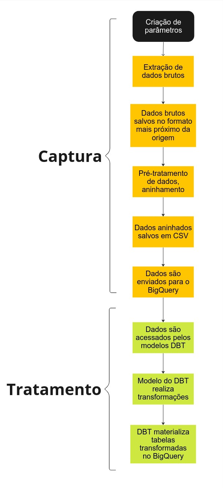

### Sobre as pipelines

Aqui na SMTR utilizamos pipelines de dados para capturar e fazer um "pré-tratamento" nos dados capturados.

As pipelines geralmente se dividem entre:
- **Captura**;
- **Tratamento**;
- **Captura e Tratamento**.

As pipelines de captura fazem a extração dos dados da fonte primária, seja ela o Google Cloud Storage, uma API ou um banco de dados local acessado via VPN, por exemplo.

Os dados são armazenados no BigQuery em forma bruta para serem tratados, posteriormente.

As pipelines de tratamento acessam os dados brutos do BigQuery e, através de modelos do DBT e de operações SQL, transformam esses dados em tabelas que podem ser consultadas e reutilizadas depois.

O tratamento destas tabelas não é refinado como o tratamento de um dataset para o treinamento de um modelo de machine learning, por exemplo. É um tratamento básico que permite ao utilizador final fazer seus próprios tratamentos e queries posteriormente.

---

### **Workflow típico de um pipeline**

