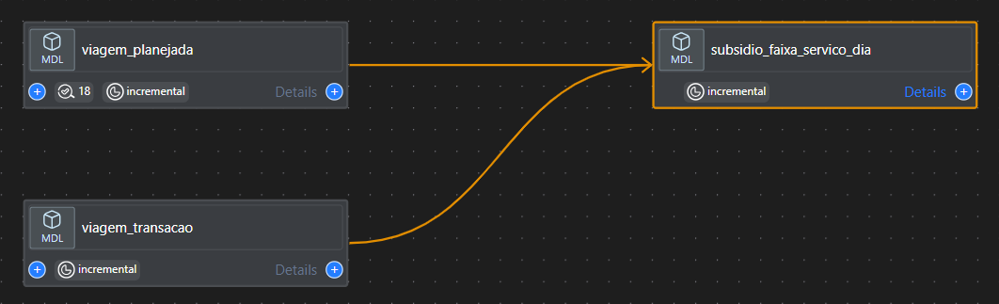
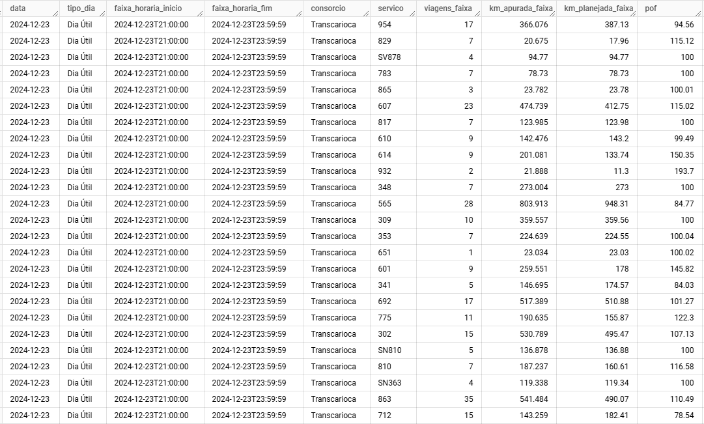
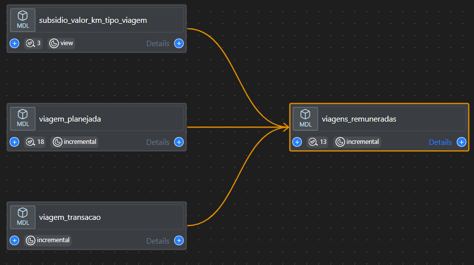
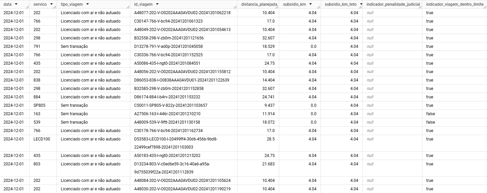

# Apuração do Subsídio (SPPO)

* [Queries](https://github.com/prefeitura-rio/pipelines_rj_smtr/tree/main/queries/models/projeto_subsidio_sppo)
* [Pipelines](https://github.com/prefeitura-rio/pipelines_rj_smtr/tree/main/pipelines/migration/projeto_subsidio_sppo)

## Etapas

### 1. Apuração de quilometragem total e cálculo do Percentual de Operação por Faixa Horária (POF)

O processo consiste em consolidar dados de viagens planejadas (`viagem_planejada`) e realizadas (`viagem_transacao`), associando-as por faixa horária e serviço, para apurar a quilometragem planejada e realizada. A partir dessa associação, calcula-se o Percentual de Operação por Faixa Horária (POF) como a relação percentual entre a quilometragem realizada e a planejada, desconsiderando as viagens não licenciadas e não vistoriadas. 

### 2. Cálculo de valor por viagem e identificação de quais viagens serão remuneradas (Teto de 120% / 200%)

O cálculo do valor por viagem é realizado combinando os dados das viagens realizadas (`viagem_transacao`) com os parâmetros de subsídio definidos na tabela `subsidio_valor_km_tipo_viagem`. Os valores de subsídio por quilômetro são regulamentados pelo Decreto RIO 53856/2023 e pela Resolução SMTR 3682/2024, considerando o status diário de cada veículo (como indicadores de licenciamento, presença de ar condicionado, autuações, entre outros). A identificação das viagens remuneradas é feita com base em critérios como o tipo de dia, a quantidade de viagens planejadas e o POF, conforme estabelecido na Resolução SMTR Nº 3645/2023.

### 3. Apuração da quilometragem e valor de pagamento

A quilometragem é calculada com base no status de cada veículo por dia, somando a quilometragem apurada para cada tipo de status, como "Registrado com ar inoperante", "Não licenciado", "Autuado por ar inoperante", "Autuado por segurança", entre outros. Os valores são determinados considerando a distância planejada, o valor do subsídio, o indicador de viagem dentro do limite e o POF.

- **valor_a_pagar**: Valor efetivo de pagamento (valor_total_apurado - valor_acima_limite - valor_glosado).
- **valor_glosado**: Valor total das viagens considerando o valor máximo por km, subtraído pelo valor efetivo por km.
- **valor_acima_limite**: Valor apurado das viagens que não foram remuneradas (por estar acima do teto de 120% / 200%).
- **valor_total_sem_glosa**: Valor total das viagens considerando o valor máximo por km.
- **valor_total_apurado**: Valor total das viagens apuradas, subtraídas as penalidades (POF =< 60%).
- **valor_judicial**: Valor de glosa depositada em juízo (Autuação por ar inoperante, Veículo licenciado sem ar, Penalidade abaixo de 60% e Notificação dos Agentes de Verão).
- **valor_penalidade**: Valor penalidade [negativa] (POF =< 60%).