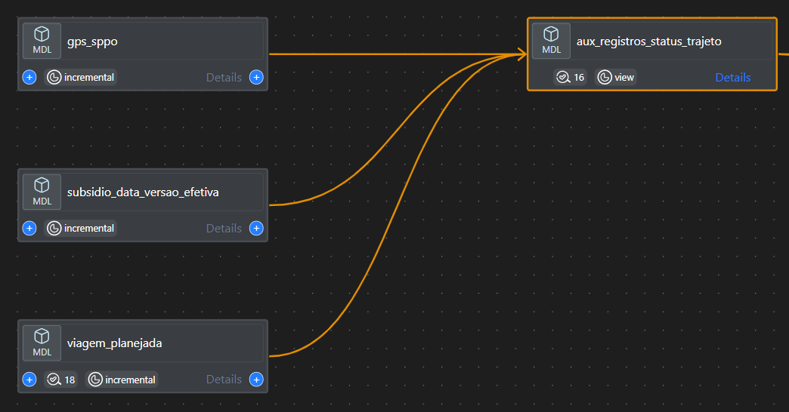
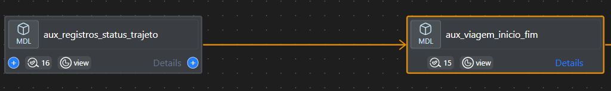
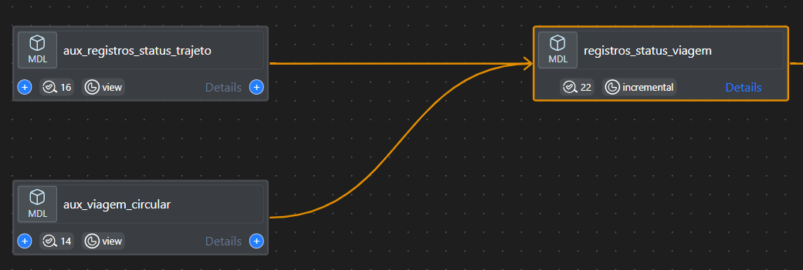
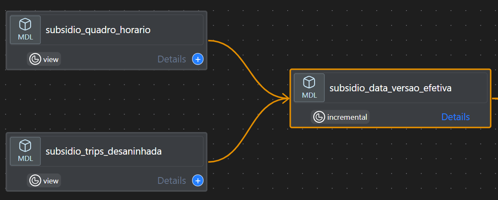
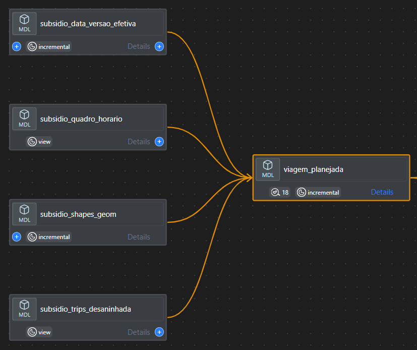

## **Glossário:**
- Distância: Cálculo da distância percorrida entre dois pontos de dados de GPS sucessivos.
- Garagem: Local onde os veículos de transporte ficam quando não estão em operação.
- GTFS: Padrão de formato de dados aberto usado para descrever informações de transporte público.
- id_veiculo: Identificação do veículo a partir de um número individual.
- id_viagem: Identificação única para cada viagem
- Modelo ephemeral: Modelo temporário que existe apenas durante a execução de uma query ou de um pipeline.
- Modelo incremental: Modelo que processa e adiciona apenas dados novos ou modificados desde a última execução.
- Plano operacional: Documento divulgado pelo site <https://transportes.prefeitura.rio> que contém as características operacionais dos serviços.
- Ponto: Comunicação pontual do GPS.
- Rota planejada: Rota planejada para aquele tipo de serviço e sentido conforme divulgado em...
- Rota realizada: Rota realizada pelo veículo em determinado tipo de serviço, sentido, data, horário
- Serviço: Codificação alfanumérica que possui itinerário pré-definido e especificação de quilometragem. 
- Shape/Shapefile - Arquivo que contem elementos georreferenciados. 
- Timestamp - Registro eletrônico de data e hora
- Viagem - O percurso completo de um veículo, partindo de um ponto inicial e terminando em um ponto final, com determinado horário de início e término.
- Viagem Circular - Viagens que o início e o fim do trajeto possuem a mesma geolocalização. 

## **1. Tabela: gps_sppo** 

- Definição: A tabela *gps_sppo* é onde são armazenados os dados do gps após passar pelas seguintes transformações de cálculo da velocidade instantânea, 
cálculo da velocidade média, análise se o veículo encontra-se parado, conformidade com a rota. 

**1.1 Cálculo da velocidade instantânea [velocidade_instantanea]**
- A velocidade instantânea é calculada dividindo a distância percorrida pelo tempo entre dois registros de timestamp consecutivos. 
- O resultado é então multiplicado por 3,6 para converter a unidade para km/h.

**1.2 Cálculo da velocidade média [velocidade_estimada_10_min]**
- Modelo ephemeral [sppo_aux_registros_velocidade.sql]
- A velocidade média é zerada quando há qualquer alteração de veículo ou serviço.
- A velocidade média é calculada a partir da média das velocidades dos últimos 10 minutos (declarado no modelo como 600 seconds).
- Antes de completar os 10 minutos, a velocidade média permanece igual a zero.
- Caso a velocidade exceda 60 km/h (sendo um outlier), ela será ajustada para 60 km/h.

**1.3 Veículo parado [tipo_parada]**
- Modelo ephemeral [sppo_aux_registros_parada]
- Veículo recebe o *status quo* de parado quando a velocidade entre dois pontos é igual a 0km/h.
- Velocidade limiar parada: 3km/h
O veículo poderá estar parado próximos a terminais (dentro de um raio de 250m) ou dentro da garagem.
Esta definição permite rotular as observações da coluna tipo_parada como "Em operação", "Parado garagem"

**1.4 Rota**
- Modelo ephemeral [sppo_aux_registros_flag_trajeto_correto]
- Etapa que objetiva analisar se o veículo realizou o trajeto correto, conforme as shapes (camadas georreferenciadas) dos trajetos e dos trajetos alternativos. 
- A partir da utilização do window_function o modelo calcula um indicador de quantas vezes o veículo esteve dentro do trajeto correto.
- A condição de trajeto correto é atingida se o veículo estiver dentro da variável buffer_segmento_metros (500 metros). 

**1.5 Linhagem do dado**

- 

**1.6 Exemplo da Tabela**

- 

### **2. Tabela: registros_status_viagem**
Caminho queries/models/projeto_subsidio_sppo/registro_status_viagem

- Objetivo: processamento do status da viagem (start, middle, end, out)

**2.1 Tratamento das viagens com serviço caracterizado como circular**
- Modelo ephemeral:aux_viagem_circular  
- Caminho queries/models/projeto_subsidios_sppo/aux_viagem_circular.sql
- Esse modelo ephemeral consulta o modelo aux_viagem_inicio_fim para filtrar apenas as viagens com sentido = "C", o objetivo é selecionar para essa análise apenas as viagens circulares.
- Ao utilizar a window function LEAD o modelo identifica o próximo registro de determinado veículo e serviço dentro de uma janela de tempo.
- flag_proximo_volta se for igual a TRUE e o sentido do shape for igual a "I" (Ida) e o datetime chegada for menor ou igual ao datetime partida volta gera um resultado que garante que o trajeto que representa a ida de uma viagem circular com sua volta logo em seguida.
- O modelo, ao realizar o particionamento de ida e volta, garante que ambos sentidos recebam o mesmo id_viagem.
- Após o tratamento das viagens circulares, o modelo concatena as viagens usando "union all" que não têm os serviços circulares. 

**2.2 Processamento**
- Modelo ephemeral: aux_registros_status_trajeto
- Caminho queries/models/projeto_subsidios_sppo/aux_registros_status_trajeto.sql

- O objetivo desse modelo é verificar se o veículo está em rota e, em caso positivo, verificar qual indicador de posição o veículo está.
- Indicador de posição:
      * start: o veículo está próximo ao início da rota.
      * middle: a viagem e o veículo recebem o status de middle a partir da primeira comunicação depois do buffer inicial (start).
      * end: o veículo encontra-se próximo ao final da rota
      * out: veículo fora da rota.
  - Vide ilustração esquemática:
  -  

- Variável buffer geográfico {{ var("buffer") }} define o quanto o veículo precisa estar próximo a rota para que o trajeto seja considerado válido ( Atualmente o buffer está declarado como 500 metros)
- Função determinística para validação do indicador de posição - ST_DWITHIN.
- Caso especial (janela temporal): eventos como o show da Madonna requerem ajuste de parâemtros como do buffer geográfico ou seleções de tipos de serviço.
- Correspondência do tipo de serviço: o modelo analisa que se o serviço informado via GPS está igual ao serviço planejado. 
- Resumo de validação da viagem:
  * Indicador de posição (start, middle, end): a comunicação do GPS deve acontecer nas três instâncias do indicador de posição.
  * O serviço planejado deve ser igual ao serviço informado.

(Verificar se é nesse trecho que instancio a faixa horária)

**2.3 Modelo de tabela: registros_status_viagem**

  -  

**2.4 Linhagem da tabela registro_status_viagem**

  -  

### **3. Tabela: viagem completa**
- Caminho queries/models/projeto_subsidio_sppo/viagem_completa.sql
- Esse modelo acessa três tabelas, sendo os itens 3.1 Viagem Planejada e 3.2 Viagem Conformidade e a Tabela de Shapes proveniente do GTFS.
- O objetivo dessa tabela é consolidar informações para cada viagem de distância planejada e distância aferida, tempo de viagem, número de registros da comunicação do GPS e apresentar o percentual de conformidade.
  * Regra de negócio: O veículo para estar em conformidade, deve no mínimo comunicar em 80% do trajeto planejado, sendo que uma comunicação deve ser no star e outra no end..
- Modelo da tabela
-  
- Linhagem da tabela
-  

**3.1 Tabela Viagem planejada**
- Modelo incremental: viagem_planejada.sql
- Caminho queries/models/projeto_subsidio_sppo/viagem_planejada.sql
- O objetivo dessa consulta para a geração do modelo viagem completa é gerar uma tabela de viagens planejadas para o período apurado.

**3.1.1 Modelo Tabela**
- 
**3.1.2 Linhagem da tabela viagem planejada**

- 

**3.2 Viagem conformidade**
- Modelo incremental: viagem_conformidade.sql
- Caminho queries/models/projeto_subsidio_sppo/viagem_conformidade.sql
- O objetivo dessa tabela que alimenta a tabela viagem completa é gerar uma tabela de viagens que analisa as conformidades conforme o planejado
- Esse modelo acessa os modelos efêmeros listados no item:
  * 2.1 Item aux_viagem_circular
- Esse modelo consulta o modelo ephemeral aux_viagem_registros (3.2.1).

     **3.2.1 aux_viagem_registro**
     - Modelo ephemeral: aux_viagem_registros.sql
     - Caminho queries/models/projeto_subsidio_sppo/ aux_viagem_registros.sql
     - Os principais objetivos desse modelo são:
       * medir a quantidade de registros;
       * medir a distância entre o início e fim do trecho;
       * contar registros de comunicações do GPS no indicador de posição (2.2): start, middle, end.

**3.2.2 Modelo Tabela Viagem Conformidade**
- 

- 
**3.2.3 Linhagem da Tabela viagem conformidade**
- 

- 
Após o processamento inicial dos dados de GPS, os registros são armazenados na tabela **aux_registros_status_trajeto**. Esse processo é estruturado em duas partes principais: processamento dos dados de **GPS** e análise do **status_viagem**.

- **Processamento de GPS:** 
## esse registro foi citado no 1 do cálculo da distância, é o mesmo?
  - Utiliza a tabela **gps_sppo** como fonte principal.
  - Seleciona todos os campos dessa tabela, exceto **longitude**, **latitude** e **serviço**.
  - Adiciona colunas extras, como:
    - **id_empresa**: Obtido a partir de uma substring de **id_veiculo**.
    - **posicao_veiculo_geo**: Cria um ponto geográfico a partir dos dados de longitude e latitude usando a função **ST_GEOGPOINT**.
  - Aplica filtros para processar apenas os dados dentro de uma janela de tempo específica (Entre D-2 às 00h até D-1 às 3h) e remove registros com o status "Parado na garagem".

- **Análise do status da viagem:**
  - Realiza um **JOIN** com a tabela **viagem_planejada**, que contém as informações das rotas planejadas para comparação.
  - A coluna **distancia** é tratada para receber um valor padrão de 0, caso os valores estejam nulos.
  - Define o **status_viagem** como "início", "fim", "meio" ou "fora", com base na proximidade do veículo a determinados pontos da rota, utilizando a função **ST_DWITHIN**.

Essa etapa é essencial para associar os dados reais de GPS aos planejamentos de rota e viagem, permitindo o monitoramento da conformidade e do status operacional de cada viagem.

 **3. Identificação do início e fim das viagens: aux_viagem_inicio_fim**

Esta etapa busca identificar com precisão os momentos de início e fim das viagens de cada veículo.

- **Ajuste dos registros de viagem (inicio_fim):**
  - Os dados são ordenados por veículo e rota. Utiliza-se a função **LEAD** para capturar a próxima **datetime_chegada** (hora de chegada), de modo a identificar a chegada prevista para o próximo ponto.
  - Exclui os registros de chegada intermediários para manter apenas o momento de chegada mais recente.

Esta etapa permite que o sistema gere um **id_viagem** único e calcule a distância entre o ponto de partida e o ponto de chegada de cada viagem.

## id_viagem é VEICULO&SERVICO&SENTIDO&SHAPE&DATA&HHMMSS? 
### **4. Registro dos status de viagem: registro_status_viagem**

Depois de identificar os registros de início e fim das viagens, os dados são combinados com a tabela **aux_viagem_circular** para identificar o comportamento circular das viagens (ida e volta).

- A tabela **registros_status_viagem** realiza um **JOIN** entre **aux_registros_status_trajeto** e **aux_viagem_circular**, cruzando os registros de veículos e trip_id.
- Só são selecionados os registros com um **id_viagem** válido e que correspondam ao período entre **datetime_partida** e **datetime_chegada**.

- **Combinação de Registros (UNION ALL):**
  - Após identificar e tratar as viagens circulares, o sistema combina esses registros com outros tipos de viagens que não são circulares, mas que também são relevantes para o processo. Isso assegura que todas as viagens úteis, sejam circulares ou não, estejam disponíveis para análises subsequentes.

### **6. Subsidio e cálculos de conformidade: subsidio_data_versao_efetiva**

Esta tabela está relacionada ao tratamento de subsídios e ao cálculo de conformidade das viagens com base em datas e versões de dados. A parte importante aqui envolve o **tratamento de tipos de dias** (calendário de operação) e a associação de cada dia a uma versão específica de dados de viagem, shape e frequência.
 
## A partir da nova regra implementada em 16/07 ampliou-se a faixa horária, mas apresenta também o conceito de viagem adicional.
 
## O que é uma viagem adicional?

- **Criação da tabela de datas:**
  - O sistema gera uma tabela temporária com datas que vão de 1º de junho de 2022 até 31 de março de 2024.
  - Cada dia é classificado com um **tipo_dia**, que pode ser um dia útil, final de semana, feriado ou dia especial. Isso garante que o sistema leve em consideração a variação nas operações conforme o tipo de dia, já que os horários de operação e padrões de viagem mudam drasticamente em feriados ou fins de semana.

- **Atribuição de versões de dados:**
  - Para cada data, o sistema associa uma **versão de dados** específica para as viagens (**data_versao_trips**), as formas geométricas das rotas (**data_versao_shapes**) e as frequências de operação (**data_versao_frequencies**).
  - Essa associação é importante para garantir que o sistema esteja sempre usando a versão correta dos dados em vigor naquele dia específico, especialmente quando há atualizações no planejamento das rotas ou nos horários de operação.

- **Cálculo de subsídio:**
  - Para cada data, é calculado um valor de subsídio por quilômetro (**valor_subsidio_por_km**), que pode variar conforme o mês e o ano. Isso garante que o cálculo de subsídios seja ajustado conforme o contexto econômico e operacional de cada período.

- **Junções com outras tabelas:**
  - A tabela de datas é então combinada com outras três tabelas de referência (trips, shapes e frequencies) para obter as versões distintas de cada data, assegurando que todas as viagens estejam ligadas à versão correta do planejamento.

### **7. Planejamento de Viagens: viagem_planejada**

Nesta etapa, o sistema prepara e organiza os dados das viagens planejadas para que possam ser comparadas com as viagens reais, garantindo a precisão do planejamento e a aderência do transporte aos padrões estabelecidos.

- **Preparação dos Dados:**
  - Utiliza os dados da tabela **subsidio_data_versao_efetiva**, para obter informações detalhadas sobre as datas e suas classificações (como tipo de dia: dia útil, fim de semana, feriado, etc.), além das versões associadas às viagens, **shapes** e frequências operacionais.
  - Seleciona os registros dessa tabela para um intervalo específico de tempo. A tabela assegura que cada dia possui uma versão específica de dados, garantindo que o sistema utilize a versão correta dos dados para o planejamento.

- **Processamento de Horários (quadro):**
  - Realiza um **JOIN** com a tabela de horários planejados (**subsidio_quadro_horario**) para associar as viagens aos horários corretos.
  - Converte os horários de início e fim (**inicio_periodo** e **fim_periodo**) para objetos datetime.

- **Integração de Dados das Viagens (trips):**
  - Faz um **JOIN** com a tabela de trips (**subsidio_trips_desaninhada**), aplicando filtros com base nas versões específicas para garantir que os dados planejados sejam alinhados corretamente.

- **Ajustes dos IDs das Trips (quadro_trips):**
  - Ajusta os IDs das trips com base na direção do trajeto (**sentido**), criando identificadores únicos que diferenciam as trips de ida, volta e circular, quando aplicável.

- **Combinação de Trips e Shapes (quadro_tratada):**
  - Integra os dados das trips ajustadas com os **shapes** das rotas, combinando os **trip_id** planejados e reais para garantir a aderência entre o planejamento e a execução.
  - Ajusta os **shape_id** com base no sentido da viagem, assegurando que a geometria associada corresponda ao trajeto planejado.

- **Processamento dos Dados de Shapes (shapes):**
  - Faz um **JOIN** com a tabela de formas geométricas (**subsidio_shapes_geom**), recuperando a geometria completa das rotas, assim como os pontos de início e fim para cada trajeto planejado.

- **Seleção e Ajuste Final:**
  - Combina as informações processadas das trips e dos shapes, estabelecendo a direção do shape (**sentido_shape**) com base nas condições observadas.
  - Adiciona colunas complementares como **id_tipo_trajeto**, **feed_version**, e a data/hora atual para registrar a última atualização (**datetime_ultima_atualizacao**).

O resultado final é um conjunto de dados consolidado que engloba todas as informações planejadas das viagens, associando horários, trajetos e geometrias. Esse conjunto serve como base para as comparações com os dados reais de execução, permitindo uma análise detalhada da conformidade e do desempenho operacional.

## Dicas: inserir todos os nomes das querys
