# Documentação consolidada do processo de apuração das viagens do transporte público municipal do Rio de Janeiro. 
*Inclui glossário, descrição dos modelos que são apresentados na sequência de execução da pipeline.*

------------------------------------------------------------------------------
------------------------------------------------------------------------------
## **Glossário:**
- **Distância aferida**: Cálculo da distância percorrida entre dois pontos de dados de GPS sucessivos;
- **Garagem**: Local onde os veículos de transporte ficam quando não estão em operação;
- **GTFS**: Arquivo contendo informações sobre linhas de ônibus e serviços de BRT da cidade do Rio de Janeiro. Atualizado mensalmente pela [Secretaria Municipal de Transportes](https://www.data.rio/datasets/8ffe62ad3b2f42e49814bf941654ea6c/about);
- **id_veiculo**: Identificação do veículo a partir de um número de ORDEM;
- **id_viagem**: Identificação única para cada viagem;
- **Modelo ephemeral e incremental**: Vide [DBT](https://docs.getdbt.com/docs/build/materializations);
- **Plano operacional**: Documento divulgado pela [Prefeitura](https://transportes.prefeitura.rio) que contém as características operacionais dos serviços;
- **Ponto**: Comunicação pontual do GPS;
- **Rota planejada**: Rota planejada para aquele tipo de serviço e sentido conforme o GTFS;
- **Rota realizada**: Rota realizada pelo veículo em determinado tipo de serviço, sentido, data, horário;
- **Serviço**: Codificação alfanumérica que possui itinerário pré-definido e especificação de quilometragem, também denominado LINHA;
- **Shape** - Elemento geométrico que representa o espaço em formato linestring ou multilinestring;
- **Timestamp** - Registro de data e hora;
- **Viagem** - O percurso completo de um veículo, partindo de um ponto inicial e terminando em um ponto final, com determinado horário de início e término[duas meias viagens];
- **Viagem Circular** - Viagens que o início e o fim do trajeto possuem a mesma geolocalização. 
-----------------------------------------------------------------------
## MODELOS DESTA DOCUMENTAÇÃO
- 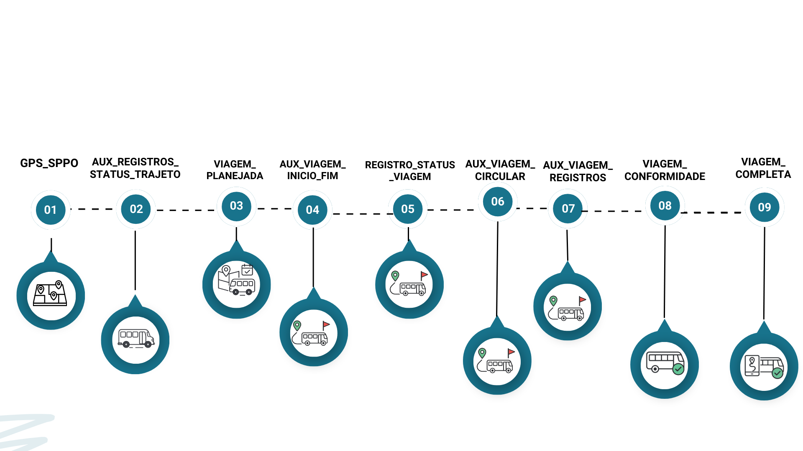

------------------------------------------------
## **ETAPA 1**

## **1. Tabela: `gps_sppo`** 
*Caminho do modelo:* 
*prefeitura_rio/pipelines_rj_smtr/queries/models/br_rj_riodejaneiro_veiculos/gps_sppo.sql*

- 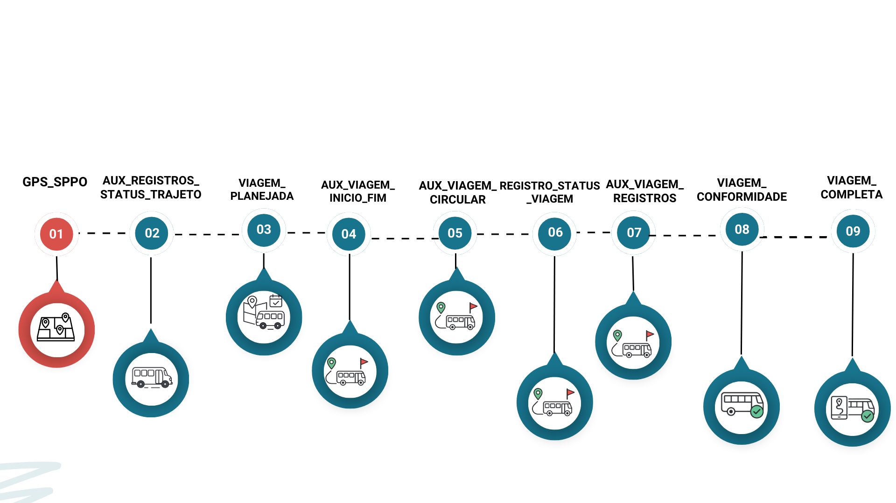

**1.1 Objetivo**: Armazenar os dados do gps após as transformações de dados que resultam no cálculo da velocidade instantânea, cálculo da velocidade média e análise da movimentação do veículo a fim de verificar se seu status é parado.

**1.2 Modelos utilizados**:  `sppo_aux_registros_filtrada`, `sppo_aux_registros_velocidade`, `sppo_aux_registros_parada`, `sppo_aux_registros_flag_trajeto_correto`, 

**1.3 Fluxo de execução do modelo**:
* Modelo Incremental particionado por data com granularidade diária;
* Realiza a junção dos tratamentos realizados no GPS;
* Filtra os dados brutos capturados;
* Identifica se os veículos estão "em operação" ou "operando fora do trajeto";
* Identifica se os veículos estão "parado fora do trajeto" ou "parado trajeto correto".

**1.4 Resultados apresentados**:
* A tabela `gps_sppo` apresenta cada linha como registro a cada 30 segundos da comunicação do GPS dos veículos particionado por data. Nesta tabela, constam os atributos:
   * Data (YYYY-mm-dd);
   * Hora (hh:mm:ss);
   * Id_veiculo;
   * Serviço (garagem ou determinada linha);
   * Dados de geolocalização latitude e longitude;
   * Tipo de parada (terminal ou garagem);
   * Flags com respostas booleanas (TRUE e FALSE): 
      * flag para verificar se o veículo está em operação, flag para verificar se o veículo está em movimento;
      * flag para verificar se o serviço existe no SIGMOB com resposta FALSE devido a descontinuação desse atributo;
      * flag cujo objetivo é retornar se o veículo está no trajeto correto;
      * flag para verificar se veículo está no trajeto correto hist
   * Status do veículo ("em operação" ou "operando fora do trajeto");
   * Velocidade instantânea;
   * Velocidade estimada nos últimos 10 minutos;
   * Distância calculada entre cada registro;
   * Versão.       

**1.5 Observaçoes**: Indicador de conformidade em rota com o SIGMOB foi descontinuado.

**1.6 Linhagem**
- 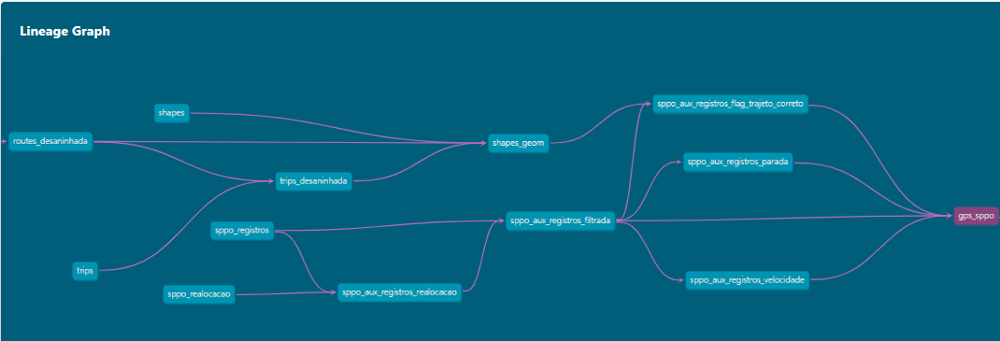

**1.7 Modelo da Tabela**
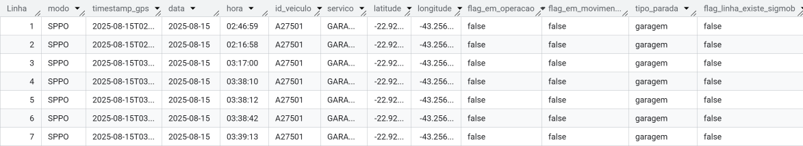
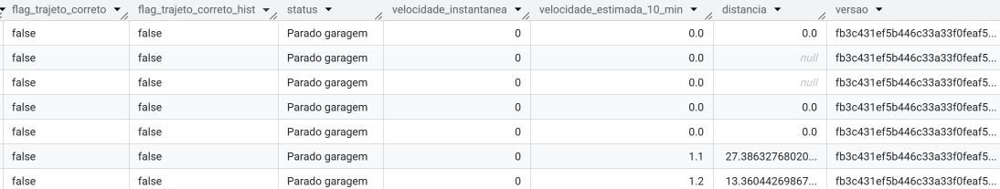
------------------------------------------------------------------------------

------------------------------------------------
## **ETAPA 2**

## **2. Tabela: `Aux_registros_status_trajeto`** 
*Caminho do modelo:* 
*prefeitura_rio/pipelines_rj_smtr/queries/models/projeto_subsidio_sppo/aux_registros_status_trajeto.sql*

- 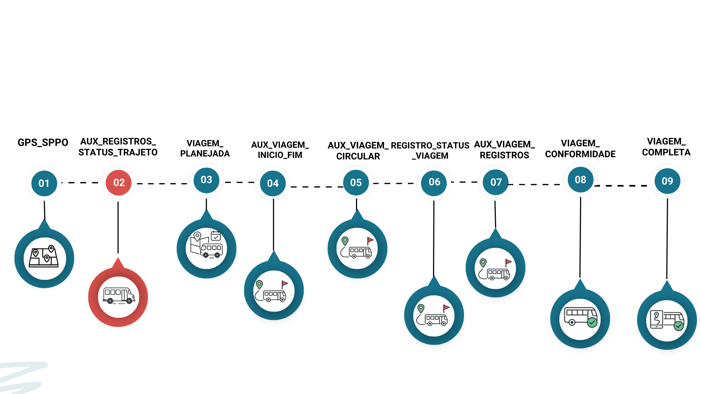

**2.1 Objetivo**: Monitorar e classificar a posição dos veículos de transporte público em relação às suas rotas planejadas

         
**2.2 Fluxo de execução do modelo**:
* Materização declarada no arquivo dbt_project.yml 
* Busca o GTFS vigente;
* Filtra registros da Tabela gps_sppo com o critério d-2;
* Remove os veículos parados em garagem;
* Associa o serviço com base no informado;
* Utiliza a função [ST_GEOGPOINT](https://cloud.google.com/bigquery/docs/reference/standard-sql/geography_functions) para criar um ponto georreferenciado;
* Utiliza a função [ST_DWINTHIN](https://cloud.google.com/bigquery/docs/reference/standard-sql/geography_functions) para verificar se a posição do veículo está dentro do planejado;
* Gera um buffer de 500 metros define o quanto o veículo precisa estar próximo a rota para que o trajeto seja considerado válido;
*  Classifica o registro do GPS em indicadores de posição:
   * start: o veículo está próximo ao início da rota.
   * middle: a viagem e o veículo recebem o status de middle a partir da primeira comunicação depois do buffer inicial (start).
   * end: o veículo encontra-se próximo ao final da rota
   * out: veículo fora da rota.
   * *Modelo esquemático*:
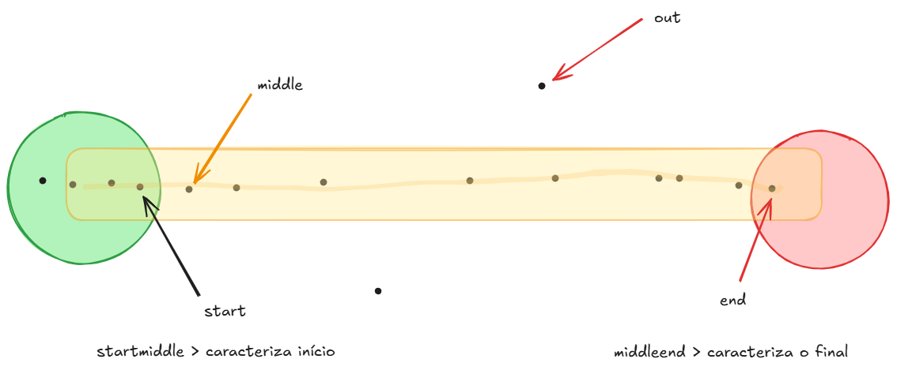
                  
**2.3 Resultados apresentados**
* A tabela `aux_registros_status_trajeto` apresenta cada linha como registro a cada 30 segundos da comunicação do GPS dos veículos particionado por data. Nesta tabela, constam os atributos:
   * Data (YYYY-mm-dd);
   * Timestamp do GPS;
   * Id_veiculo;
   * Id_empresa;
   * Serviço informado;
   * Serviço realizado;
   * Dados de geolocalização do veículo em formato wkt POINT;
   * Shape id;
   * Shape id planejado;
   * Sentido da Shape (ida ou volta);
   * Sentido;
   * Trip id;
   * Trip planejado;
   * Definição do Start e do End point, conforme definido no indicador de posição;
   * Distância planejada;
   * Distância realizada;
   * Status da viagem, com a informação se aquele registro está no star, middle, end ou out com relação a rota; 
    * Versão.   

**2.4 Linhagem**

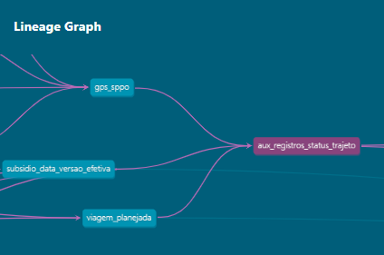

**2.5 Modelo da Tabela**

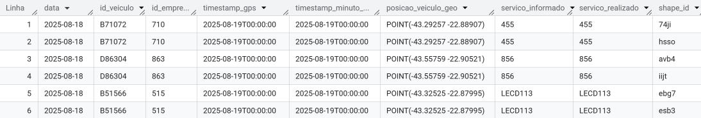
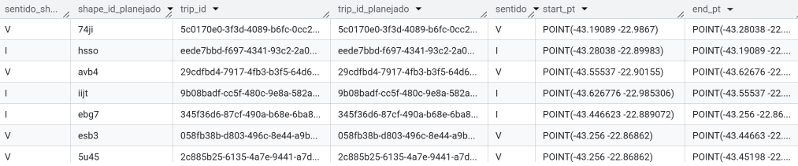
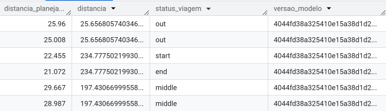
------------------------------------------------------------------------------
------------------------------------------------------------------------------
## **ETAPA 3**

## **3. Tabela: `viagem_planejada`** 
*Caminho do modelo:* 
*prefeitura_rio/pipelines_rj_smtr/queries/models/projeto_subsidio_sppo/viagem_planejada.sql*

- 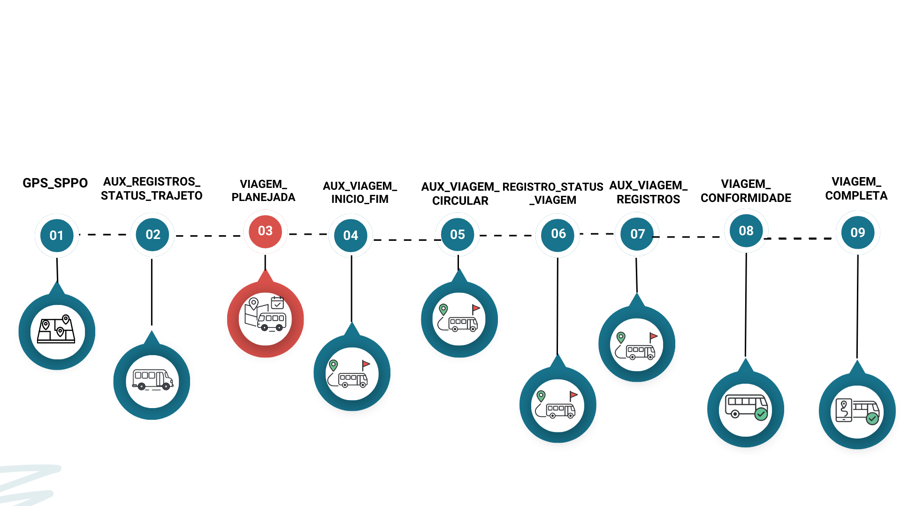

**3.1 Objetivo**: Criar uma tabela unificada de viagens planejadas.
         
**3.2 Fluxo de execução do modelo**:
* Materização incremental
* Uni as tabelas de `viagem_planejada1` e `viagem_plenajada2`.
                  
**3.3 Resultados apresentados**
* A tabela `viagem_planejada` apresenta cada linha como registro com os seguintes atributos:
   * Data (YYYY-mm-dd);
   * Tipo_dia, especificação quanto ao dia útil, sábado, domingo, feriado, dias atípicos;
   * Serviço;
   * Vista que trata do nome do itinerário;
   * Consórcio;
   * Sentido (Ida/Volta);
   * Partida_total_planejada que traz quantas partidas são especificadas;
   * Distância Planejada por viagem;
   * Distância Total para o dia;
   * Início do período;
   * Fim do Período;
   * Faixa Horária Início;
   * Faixa Horária Fim;
   * Trip id planejado;
   * Trip id;
   * Shape id;
   * Shape id planejado;
   * Shape (em formato multilinestring);
   * sentido_shape;
   * Start_pt, ponto de início da viagem;
   * End_pt, ponto final da viagem;
   * Id_tipo_trajeto;
   * Feed Version;
   * Feed Start Date;
   * Datetime da última atualização;

**3.4 Linhagem**:

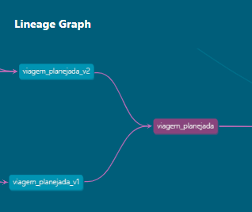

**3.5 Modelo da Tabela**

 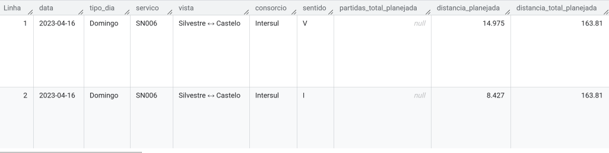
 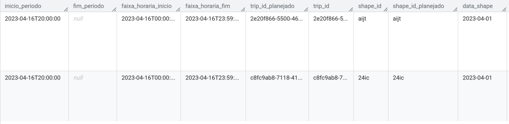
 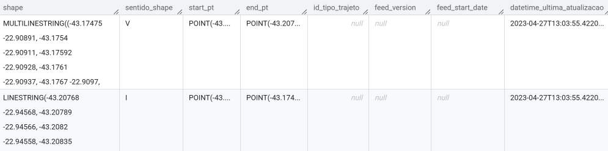

------------------------------------------------------------------------------
------------------------------------------------------------------------------
## **ETAPA 4**

## **4. Tabela: `aux_viagem_inicio_fim`** 
*Caminho do modelo:* 
*prefeitura_rio/pipelines_rj_smtr/queries/models/projeto_subsidio_sppo/aux_viagem_inicio_fim.sql*

- 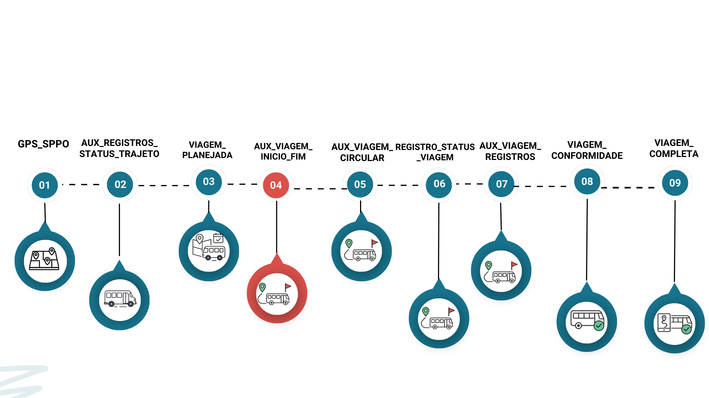

**4.1 Objetivo**: Elabora um parâmetro das viagens completas (partida e chegada) de cada veículo no shape planejado.
         
**4.2 Fluxo de execução do modelo**:
* Materização declarada no arquivo dbt_project.yml;
* Cria coluna identificadora para início (start) e fim (end) da viagem;
* Coloca no mesmo registro início e o fim da viagem, e posições geográficas de início e fim, utilizando a função [LEAD](https://cloud.google.com/bigquery/docs/reference/standard-sql/navigation_functions#lead);
* Cria um id único para a viagem, utilizando o id_veiculo, sentido, shape_id_planejado e data;
* Calcula a distância entre a posição inicial e final por meio da função [ST_DISTANCE](https://cloud.google.com/bigquery/docs/reference/standard-sql/geography_functions#st_distance), transformando a distância em metros.
                  
**4.3 Resultados apresentados**
Transforma a sequência de pontos do GPS em uma viagem com data e hora, posição inicial e final, distância real e planejada e cria um id único com o objetivo de fornecer insumos para a Tabela Viagem em conformidade.

**4.4 Linhagem**:
- 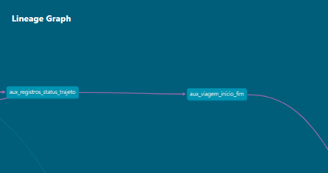

------------------------------------------------------------------------------
------------------------------------------------------------------------------
## **ETAPA 5**

## **5 Tabela: `aux_viagem_circular`** 
*Caminho do modelo:* 
 *prefeitura_rio/pipelines_rj_smtr/queries/models/projeto_subsidio_sppo/aux_viagem_circular.sql*

- 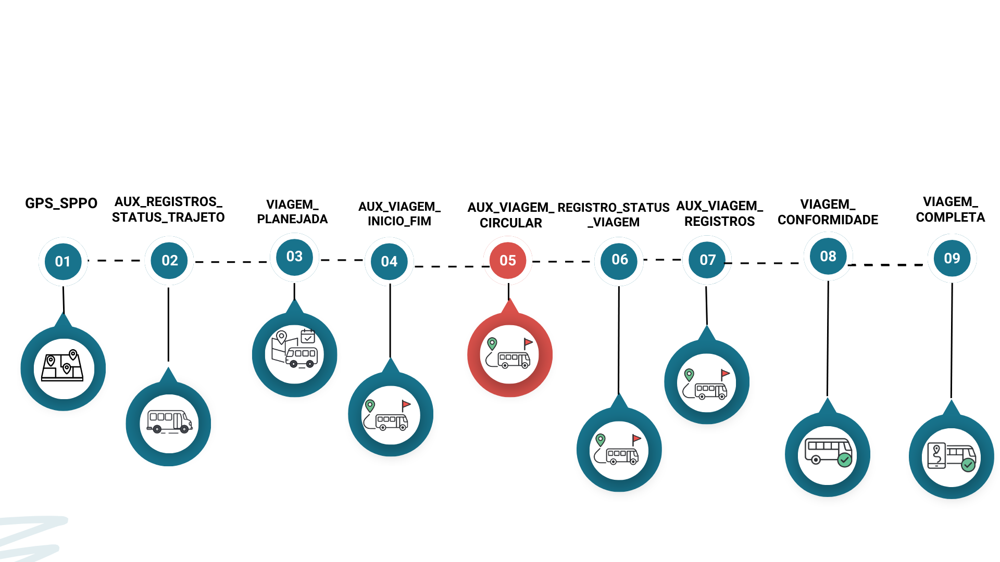

**5.1 Objetivo**:Identificar viagens de ida que possuem volta consegutiva, realizando o pivot para uma única linha com datetime de ida e datetime de volta. 
         
**5.2 Fluxo de execução do modelo**:
* Utiliza a função [LEAD](https://cloud.google.com/bigquery/docs/reference/standard-sql/navigation_functions#lead) para inserir em mesmor registro o datetime ida e o datetime volta;
* Utiliza o modelo `aux_viagem_inicio_fim` e cruza com uma view de ida_volta_circular para armazenar os dados de ida e volta e depois atribui um id_viagem sendo o mesmo para ida quanto para volta.
                  
**5.3 Resultados apresentados**
* Para viagens circulares é garantido um id_viagem tanto para ida quanto para volta. 

**5.4 Linhagem**:

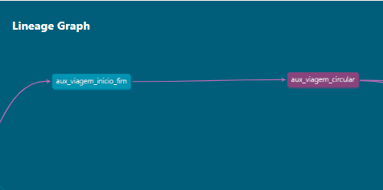

-----------------------------------------------------------------------------
------------------------------------------------------------------------------
## **ETAPA 6**

## **6 Tabela: `registros_status_viage`** 
*Caminho do modelo:* 
*prefeitura_rio/pipelines_rj_smtr/queries/models/projeto_subsidio_sppo/registros_status_viagem.sql*

- 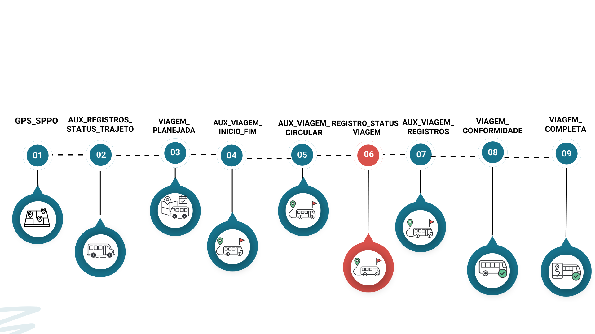

**6.1 Objetivo**: Filtrar apenas viagens que possuem início e fim, a partir dos modelos. `aux_registros_status_trajeto`e `aux_viagem_circular`.
         
**6.2 Fluxo de execução do modelo**:
* Materização incremental com partição diária;
* Associa o veículo id_veiculo;
* Faz um join entre as tabelas `aux_registros_status_trajeto`e `aux_viagem_circular`
                  
**6.3 Resultados apresentados**
* A tabela `registros_status_viagem` apresenta cada linha como registro com os seguintes atributos:
   * Data (YYYY-mm-dd);
   * Id_veiculo;
   * Id_empresa;
   * Timestamp_gps
   * Timestamp_minutos que desconsidera os segundos do timestamp_gps;
   * Posição georreferenciada do veículo;
   * Serviço informado;
   * Serviço realizado;
   * Shape_id e Shape id_planejado;
   * Sentido Shpae (Ida 'I' e Volta 'V');
   * Trip_id e Trip_id planejado;
   * Sentido (Ida 'I' e Volta 'V');
   * Start_pt ponto de início georreferenciado;
   * End_pt ponto de fim da viagem georreferenciado;
   * Distância planeada;
   * Distância realizada;
   * Status da viagem (start, middle, end, out);
   * Datetime_partida;
   * Datetime_chegada;
   * Distância Início-Fim;
   * id_viagem.
 

**6.4 Linhagem**:

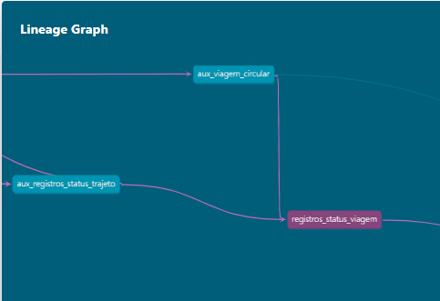

**6.5 Modelo da Tabela**

 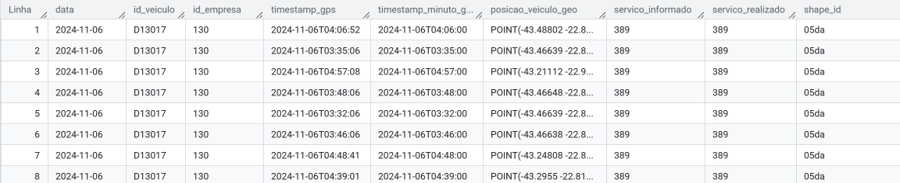
 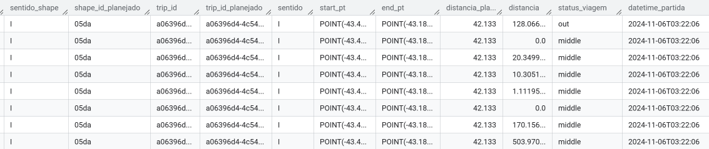
 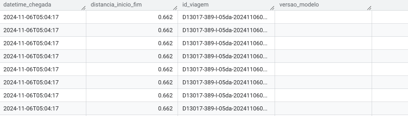

-----------------------------------------------------------------------------
------------------------------------------------------------------------------
## **ETAPA 7**

## **7 Tabela: `aux_viagem_registros`** 
*Caminho do modelo:* 
*prefeitura_rio/pipelines_rj_smtr/queries/models/projeto_subsidio_sppo/aux_viagem_registros.sql*

- 

**7.1 Objetivo**: Unificar no atributo registros_shape a quantidade de comunicações e calcula a distância total
         
**7.2 Fluxo de execução do modelo**:
* Conta quantos registros ocorreram em start, middle e end;
* Calcula a distância total, inclusive juntando as viagens de ida e volta circular para a totalização da viagem.

**7.3 Resultados apresentados**
* A tabela `aux_viagem_registros` apresenta indicadores por viagem com a distância aferida, pontos de gps por fase (start, middle, end e out) e quantos minutos tiveram registros de gps.

 
**7.4 Linhagem**:

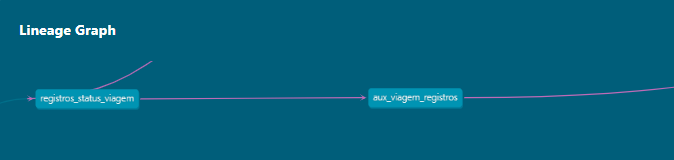

-----------------------------------------------------------------------------
------------------------------------------------------------------------------
## **ETAPA 8**

## **8 Tabela: `Viagem_conformidade`** 
*Caminho do modelo:* 
*prefeitura_rio/pipelines_rj_smtr/queries/models/projeto_subsidio_sppo/viagem_conformidade.sql*

- 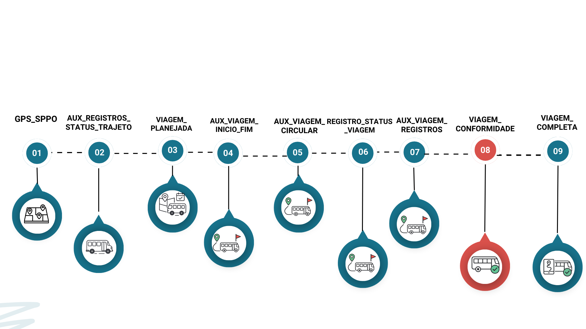

**8.1 Objetivo**: Calcular o tempo total de viagem, os percentuais de conformidade de distância e os registros no shape
         
**8.2 Fluxo de execução do modelo**:
* Materialização incremental com particionamento por data e granularidade diária;
* Calcula o percentual de conformidade do shape, dividindo o registro do shape pelos registros totais;
* Calcula o percentual de conformidade da distância, dividindo a distância aferida pela distância planejada;
* Calcula o percentual de conformidade de registros da comunicação do gps ao dividir o número de registros por minuto pelo tempo total da viagem.

**8.3 Resultados apresentados**
* A tabela `Viagem_conformidade` apresenta:
   * Id_viagem;
   * Data (YYYY-mm-dd);
   * Id_empresa;
   * Id_veiculo;
   * Serviço informado;
   * Serviço realizado;
   * Distância planejada;
   * Sentido (ida "I", volta "V");
   * Datetime_partida, ou seja, o horário que a viagem iniciou;
   * Datetime_chegada, ou seja, o horário que a viagem finalizou;
   * Trip_id;
   * Shape_id;
   * Tempo de viagem em minutos;
   * Distância aferida em metros;
   * Distância entre o início e fim em quilometrs;
   * Número de registros separadamente de start, middle, end e out;
   * Número total de registros que é a soma do item anterior;
   * Número de registros por minuto;
   * Número de registros na shape;
   * Velocidade média;
   * E os percentuais de conformidade:
      * conformidade_shape;
      * conformidade_distância;
      * conformidade_registros.

 
**8.4 Linhagem**

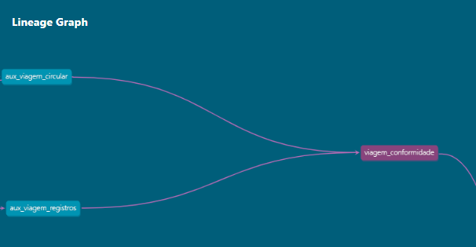

**8.5 Modelo da Tabela**

 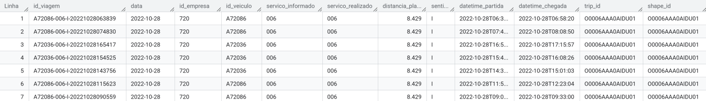
 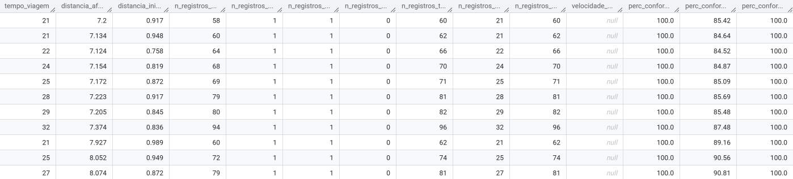

------------------------------------------------------------------------------
------------------------------------------------------------------------------

## **ETAPA 9**

## **9 Tabela: `Viagem_completa`** 
*Caminho do modelo:* 
*prefeitura_rio/pipelines_rj_smtr/queries/models/projeto_subsidio_sppo/viagem_completa.sql*

- 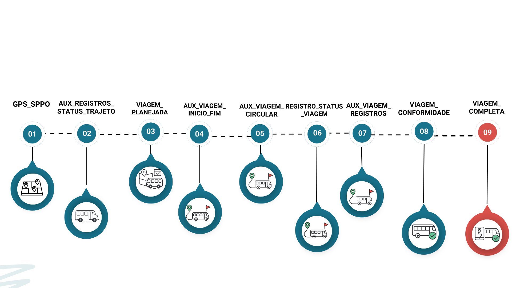

**9.1 Objetivo**: Consolidar das viagens e apresentação dos indicadores.
         
         
**8.2 Fluxo de execução do modelo**:
* Materização incremental com granularidade diária;
* Identifica as viagens que estão dentro do `viagem_planejada`;
* Realiza uma seleção completa de acordo com a conformidade;
* Faz a associação de serviço informado e serviço realizado;
* Analisa se a velocidade média está de acordo com a velocidade mínima;
* Utiliza as funções:
   * [ST_BUFFER](https://cloud.google.com/bigquery/docs/reference/standard-sql/geography_functions#st_bufferwithtolerance) para criar um ponto em volta do start (ponto que a viagem se inicia);
   * [ST_INTERSECTION](https://cloud.google.com/bigquery/docs/reference/standard-sql/geography_functions#st_intersection) para cruzar a área com o shape;
   * [ST_NUMGEOMETRIES](https://cloud.google.com/bigquery/docs/reference/standard-sql/geography_functions#st_numgeometries)

* Analisa se os percentuais de conformidade estão dentro dos mínimos declarados no dbt_project;
* Possibilita ajuste no modelo diante de atipicidade, como shows, reveillon, etc. 

**8.3 Resultados apresentados**
* A tabela `Viagem_completa` apresenta a consolidação de todas as informações e possui os seguintes atributos:
   * Consórcio;
   * Data (YYYY-mm-dd);
   * Tipo de dia (útil, sábado, domingo, ponto facultativo, atípico);
   * Id_empresa;
   * Id_veiculo;
   * Id_viagem;
   * Serviço informado;
   * Serviço realizado;
   * Vista que são os bairros de atendimento;
   * Trip_id;
   * Shape_id;
   * Datetime_partida, ou seja, o horário que a viagem iniciou;
   * Datetime_chegada, ou seja, o horário que a viagem finalizou;
   * Início do período da faixa horária;
   * Fim do período da faixa horária;
   * Tipo_viagem (Exemplo: "Completa Linha correta" ou "Completa linha incorreta");
   * Tempo de viagem;
   * Tempo planejado;
   * Distância planejada em quilometros;
   * Distância aferida em quilometros;
   * Sentido (ida "I", volta "V");
   * Número de registros na shape;
   * Número total de registros;
   * Tempo de viagem em minutos;
   * Distância aferida em metros;
   * Distância entre o início e fim em quilometrs;
   * Número de registros;
   * Número de registros por minuto;
   * Velocidade média;
   * E os percentuais de conformidade:
      * conformidade_shape;
      * conformidade_distância;
      * conformidade_registros;
   * Datetime com a última atualização.

 
**9.4 Linhagem**

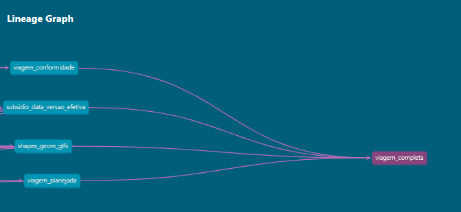

**8.5 Modelo da Tabela**

 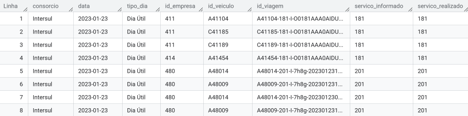
 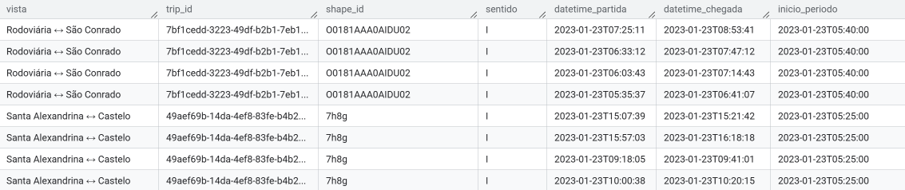
 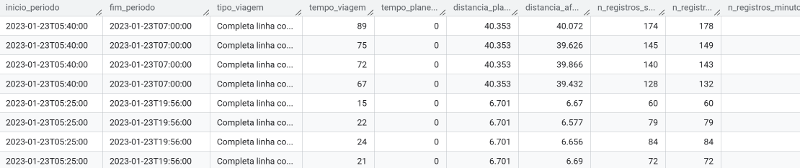
 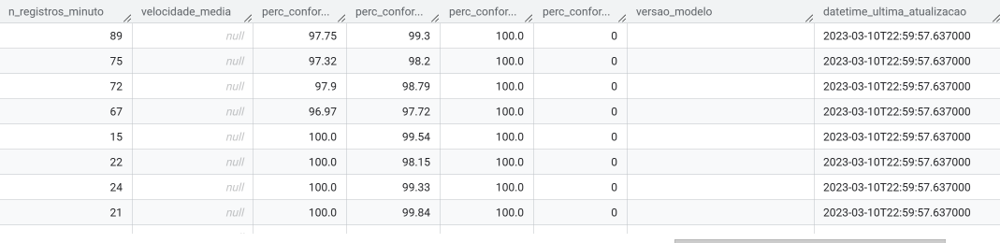

------------------------------------------------------------------------------
------------------------------------------------------------------------------
## **REFERENCIAS**

- DBT <https://learn.getdbt.com/courses/dbt-fundamentals>;
- Documentação DBT Rio <https://docs.mobilidade.rio/#!/overview?g_v=1&g_i=%2Bviagem_completa>;
- Documentação GITHUB <https://docs.github.com/pt>
- Função ST_DISTANCE <https://learn.microsoft.com/pt-br/stream-analytics-query/st-distance>;
- Função ST_DWITHIN <http://postgis.net/docs/ST_DWithin.html>;
- Função ST_INTERSECTBOX <https://postgis.net/docs/ST_Intersects.html>;
- Fumção ST_GEOGFROMTEXT <https://cloud.google.com/bigquery/docs/reference/standard-sql/geography_functions]>;
- Função ST_GEOPOINT <https://cloud.google.com/bigquery/docs/reference/standard-sql/geography_functions]>;
- Função LAG <https://www.postgresql.org/docs/current/functions-window.html]>;
- Função LEAD <https://learn.microsoft.com/pt-br/sql/t-sql/functions/lead-transact-sql?view=sql-server-ver16>;
- Função WINDOW <https://www.postgresql.org/docs/current/functions-window.html>;
- GTFS Rio <https://www.data.rio/datasets/8ffe62ad3b2f42e49814bf941654ea6c/about>;
- Materialização de modelos <https://docs.getdbt.com/docs/build/materializations>;
- Openmetadata <https://metadata.mobilidade.rio>
- Plano Operacional <https://transportes.prefeitura.rio>.

