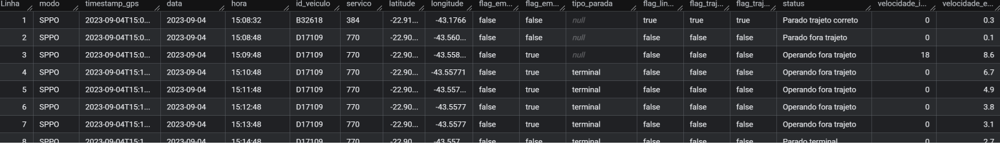
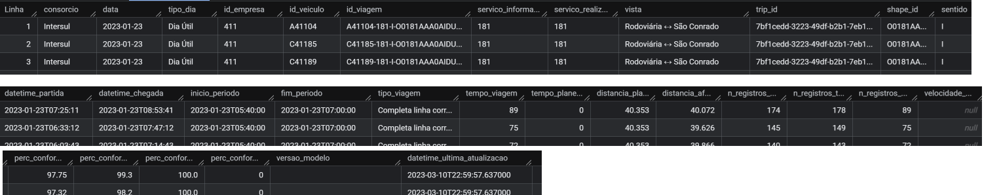
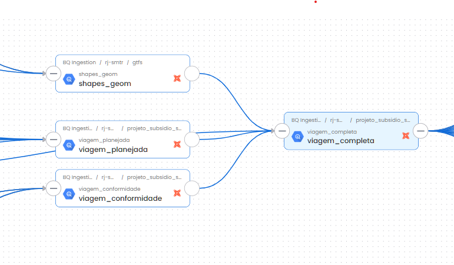
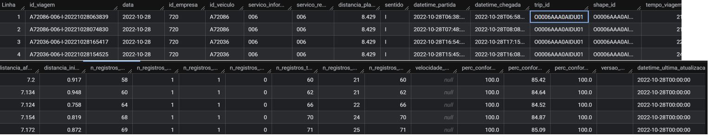
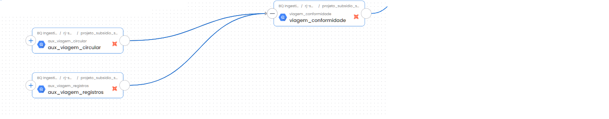

### Documentação consolidada do processo de apuração das viagens para o subsídio do transporte público municipal do Rio de Janeiro. 
*Inclui glossário, descrição dos modelos que são apresentados na sequência de execução da pipeline.*

## **Glossário:**
- **Distância aferida**: Cálculo da distância percorrida entre dois pontos de dados de GPS sucessivos.
- **Garagem**: Local onde os veículos de transporte ficam quando não estão em operação.
- **GTFS**: Arquivo contendo informações sobre linhas de ônibus e serviços de BRT da cidade do Rio de Janeiro. Atualizado mensalmente pela Secretaria Municipal de Transportes <https://www.data.rio/datasets/8ffe62ad3b2f42e49814bf941654ea6c/about>
- **id_veiculo**: Identificação do veículo a partir de um número de ordem.
- **id_viagem**: Identificação única para cada viagem
- **Modelo ephemeral e incremental**: Vide DBT (<https://docs.getdbt.com/docs/build/materializations>)
- **Plano operacional**: Documento divulgado pelo site <https://transportes.prefeitura.rio> que contém as características operacionais dos serviços.
- **Ponto**: Comunicação pontual do GPS.
- **Rota planejada**: Rota planejada para aquele tipo de serviço e sentido conforme o GTFS.
- **Rota realizada**: Rota realizada pelo veículo em determinado tipo de serviço, sentido, data, horário
- **Serviço**: Codificação alfanumérica que possui itinerário pré-definido e especificação de quilometragem. 
- **Shape** - Elemento geométrico que representa o espaço em formato linestring ou multilinestring.
- **Timestamp** - Registro de data e hora
- **Viagem** - O percurso completo de um veículo, partindo de um ponto inicial e terminando em um ponto final, com determinado horário de início e término[duas meias viagens].
- **Viagem Circular** - Viagens que o início e o fim do trajeto possuem a mesma geolocalização. 

------------------------------------------------------------------------------
## **1. Tabela: gps_sppo** 
- Caminho do modelo: prefeitura_rio/pipelines_rj_smtr/queries/models/br_rj_riodejaneiro_veiculos/gps_sppo.sql
- Modelo Incremental particionado por data com granularidade diária.

* **1.1 Objetivo**: A tabela *gps_sppo* armazena os dados do gps após passar pelas transformações de cálculo da velocidade instantânea, cálculo da velocidade média, análise se o veículo encontra-se parado, conformidade com a rota.

* **1.2 Fluxo de execução do modelo**:
 - *CTE[registros]*: seleciona os registros do gps por um filtro de data.
      - Utiliza a tabela ephemeral *sppo_aux_registros_filtrada* e seleciona os campos id_veiculo, timestamp_gps, timestamp_caputura, velocidade, linha, latitude e longitude.
    
 - *CTE[velocidades]*: seleciona as informações de velocidade, distância e movimento.
   - Utiliza a tabela ephemeral *sppo_aux_registros_velocidade* e seleciona os campos id_veiculo, timestamp_gps, velocidade, linha, distancia, flag_em_movimento.
   
 - *CTE[paradas]*: seleciona os tipos parada dos veiculos, como terminal, garagem.
   - Utiliza a tabela ephemeral *sppo_aux_registros_parada* e seleciona os campos id_veiculo, timestamp_gps, linha, tipo de parada.

 - *CTE[flags]*: seleciona as flags (indicadores) que determinam de forma booleana (True ou False) se o veículo está dentro do trajeto correto, além de verificar se a linha existe no sigmob.
   - Utiliza a tabela ephemeral *sppo_aux_registros_flag_trajeto_correto* e seleciona os campos id_veiculo, timestamp_gps, linha, route_id, flag_linha_existe_sigmob, flag_trajeto_correto, flag_trajeto_correto_hist .
  
- *Junção final*: seleciona as informações das CTE´s classifica se o veículo está em operação, operando fora do trajeto e define o tipo de parada, como parado trajeto correto e parado fora do trajeto.

* **1.3 Resultados apresentados**
- *Cálculo da velocidade instantânea [velocidade_instantanea]*
  - A velocidade instantânea é calculada dividindo a distância percorrida pelo tempo entre dois registros de timestamp consecutivos. 
  - O resultado é então multiplicado por 3,6 para converter a unidade para km/h.

- *Cálculo da velocidade média [velocidade_estimada_10_min]*
  - Modelo ephemeral [sppo_aux_registros_velocidade.sql]
  - A velocidade média é zerada quando há qualquer alteração de veículo ou serviço.
  - A velocidade média é calculada a partir da média das velocidades dos últimos 10 minutos (declarado no modelo como 600 seconds).
  - Antes de completar os 10 minutos, a velocidade média permanece igual a zero.
  - Caso a velocidade exceda 60 km/h (sendo um outlier), ela será ajustada para 60 km/h.

- *Veículo parado [tipo_parada]*
  - Modelo ephemeral [sppo_aux_registros_parada]
  - Veículo recebe o *status quo* de parado quando a velocidade entre dois pontos é igual a 0km/h.
  - Velocidade limiar parada: 3km/h
  - O veículo poderá estar parado próximos a terminais (dentro de um raio de 250m) ou dentro da garagem.
  Esta definição permite rotular as observações da coluna tipo_parada como "Em operação", "Parado garagem"

 * **1.4 Linhagem**:
- 

* **1.5 Modelo da Tabela**:
- 

**1.1 Cálculo da velocidade instantânea [velocidade_instantanea]**
- A velocidade instantânea é calculada dividindo a distância percorrida pelo tempo entre dois registros de timestamp consecutivos. 
- O resultado é então multiplicado por 3,6 para converter a unidade para km/h.

**1.2 Cálculo da velocidade média [velocidade_estimada_10_min]**
- Modelo ephemeral [sppo_aux_registros_velocidade.sql]
- A velocidade média é zerada quando há qualquer alteração de veículo ou serviço.
- A velocidade média é calculada a partir da média das velocidades dos últimos 10 minutos (declarado no modelo como 600 seconds).
- Antes de completar os 10 minutos, a velocidade média permanece igual a zero.
- Caso a velocidade exceda 60 km/h (sendo um outlier), ela será ajustada para 60 km/h.

**1.3 Veículo parado [tipo_parada]**
- Modelo ephemeral [sppo_aux_registros_parada]
- Veículo recebe o *status quo* de parado quando a velocidade entre dois pontos é igual a 0km/h.
- Velocidade limiar parada: 3km/h
O veículo poderá estar parado próximos a terminais (dentro de um raio de 250m) ou dentro da garagem.
Esta definição permite rotular as observações da coluna tipo_parada como "Em operação", "Parado garagem"

**1.4 Rota**
- Modelo ephemeral [sppo_aux_registros_flag_trajeto_correto]
- Etapa que objetiva analisar se o veículo realizou o trajeto correto, conforme as shapes (camadas georreferenciadas) dos trajetos e dos trajetos alternativos. 
- A partir da utilização do window_function o modelo calcula um indicador de quantas vezes o veículo esteve dentro do trajeto correto.
- A condição de trajeto correto é atingida se o veículo estiver dentro da variável buffer_segmento_metros (500 metros). 

**1.5 Linhagem do dado**

- 

**1.6 Exemplo da Tabela**

- 

------------------------------------------------------------------------------

### **2. Tabela: registros_status_viagem**
Caminho queries/models/projeto_subsidio_sppo/registro_status_viagem

- Objetivo: processamento do status da viagem (start, middle, end, out)

**2.1 Tratamento das viagens com serviço caracterizado como circular**
- Modelo ephemeral:aux_viagem_circular  
- Caminho queries/models/projeto_subsidios_sppo/aux_viagem_circular.sql
- Esse modelo ephemeral consulta o modelo aux_viagem_inicio_fim para filtrar apenas as viagens com sentido = "C", o objetivo é selecionar para essa análise apenas as viagens circulares.
- Ao utilizar a window function LEAD o modelo identifica o próximo registro de determinado veículo e serviço dentro de uma janela de tempo.
- flag_proximo_volta se for igual a TRUE e o sentido do shape for igual a "I" (Ida) e o datetime chegada for menor ou igual ao datetime partida volta gera um resultado que garante que o trajeto que representa a ida de uma viagem circular com sua volta logo em seguida.
- O modelo, ao realizar o particionamento de ida e volta, garante que ambos sentidos recebam o mesmo id_viagem.
- Após o tratamento das viagens circulares, o modelo concatena as viagens usando "union all" que não têm os serviços circulares. 

**2.2 Processamento**
- Modelo ephemeral: aux_registros_status_trajeto
- Caminho queries/models/projeto_subsidios_sppo/aux_registros_status_trajeto.sql

- O objetivo desse modelo é verificar se o veículo está em rota e, em caso positivo, verificar qual indicador de posição o veículo está.
- Indicador de posição:
      * start: o veículo está próximo ao início da rota.
      * middle: a viagem e o veículo recebem o status de middle a partir da primeira comunicação depois do buffer inicial (start).
      * end: o veículo encontra-se próximo ao final da rota
      * out: veículo fora da rota.
  - Vide ilustração esquemática:
  -  

- Variável buffer geográfico {{ var("buffer") }} define o quanto o veículo precisa estar próximo a rota para que o trajeto seja considerado válido ( Atualmente o buffer está declarado como 500 metros)
- Função determinística para validação do indicador de posição - ST_DWITHIN.
- Caso especial (janela temporal): eventos como o show da Madonna requerem ajuste de parâemtros como do buffer geográfico ou seleções de tipos de serviço.
- Correspondência do tipo de serviço: o modelo analisa que se o serviço informado via GPS está igual ao serviço planejado. 
- Resumo de validação da viagem:
  * Indicador de posição (start, middle, end): a comunicação do GPS deve acontecer nas três instâncias do indicador de posição.
  * O serviço planejado deve ser igual ao serviço informado.

(Verificar se é nesse trecho que instancio a faixa horária)

**2.3 Modelo de tabela: registros_status_viagem**

  -  

**2.4 Linhagem da tabela registro_status_viagem**

  -  

------------------------------------------------------------------------------
### **3. Tabela: viagem completa**
- Caminho queries/models/projeto_subsidio_sppo/viagem_completa.sql
- Esse modelo acessa três tabelas, sendo os itens 3.1 Viagem Planejada e 3.2 Viagem Conformidade e a Tabela de Shapes proveniente do GTFS.
- O objetivo dessa tabela é consolidar informações para cada viagem de distância planejada e distância aferida, tempo de viagem, número de registros da comunicação do GPS e apresentar o percentual de conformidade.
  * Regra de negócio: O veículo para estar em conformidade, deve no mínimo comunicar em 80% do trajeto planejado, sendo que uma comunicação deve ser no star e outra no end..
- Modelo da tabela
-  
- Linhagem da tabela
-  

**3.1 Tabela Viagem planejada**
- Modelo incremental: viagem_planejada.sql
- Caminho queries/models/projeto_subsidio_sppo/viagem_planejada.sql
- O objetivo dessa consulta para a geração do modelo viagem completa é gerar uma tabela de viagens planejadas para o período apurado.

**3.1.1 Modelo Tabela**
- 
**3.1.2 Linhagem da tabela viagem planejada**

- 

**3.2 Viagem conformidade**
- Modelo incremental: viagem_conformidade.sql
- Caminho queries/models/projeto_subsidio_sppo/viagem_conformidade.sql
- O objetivo dessa tabela que alimenta a tabela viagem completa é gerar uma tabela de viagens que analisa as conformidades conforme o planejado
- Esse modelo acessa os modelos efêmeros listados no item:
  * 2.1 Item aux_viagem_circular
- Esse modelo consulta o modelo ephemeral aux_viagem_registros (3.2.1).

     **3.2.1 aux_viagem_registro**
     - Modelo ephemeral: aux_viagem_registros.sql
     - Caminho queries/models/projeto_subsidio_sppo/ aux_viagem_registros.sql
     - Os principais objetivos desse modelo são:
       * medir a quantidade de registros;
       * medir a distância entre o início e fim do trecho;
       * contar registros de comunicações do GPS no indicador de posição (2.2): start, middle, end.

**3.2.2 Modelo Tabela Viagem Conformidade**
- 

- 
**3.2.3 Linhagem da Tabela viagem conformidade**
- 

------------------------------------------------------------------------------

**4. Tabela subsidio_data_versao_efetiva**
- Modelo Incremental: subsidio_data_versao_efetiva.sql
- Caminho queries/models/projeto_subsidio_sppo/subsidio_data_versao_efetiva.sql
- O objetivo desse modelo é criar um calendário operacional, classificando os tipos de dia como:
  * Dia útil,
  * Sábado,
  * Domingo,
  * Ponto Facultativo.
- O modelo faz a classificação por subtipo de dia, classificados como:
  * Verão,
  * E eventos como (Show da Madonna, Rock in Rio, Concurso Público Unificado (CNU), Eleição.
- O modelo capta a última data_versao, considerando um intervalo de 30 dias, que consta nas tabelas trips, shapes e frequencies.
- No modelo atual há especificação de datas atípicas, como eventos na cidade.
- Atenção para a variável: {var('DATA_SUBSIDIO_**_INICIO')- Declarada no dbt_project com datas importantes. 

**4.1 Modelo de tabela**

**4.2 Linhagem do dado**

------------------------------------------------------------------------------

------------------------------------------------------------------------------

