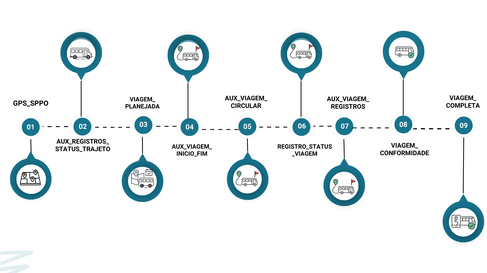
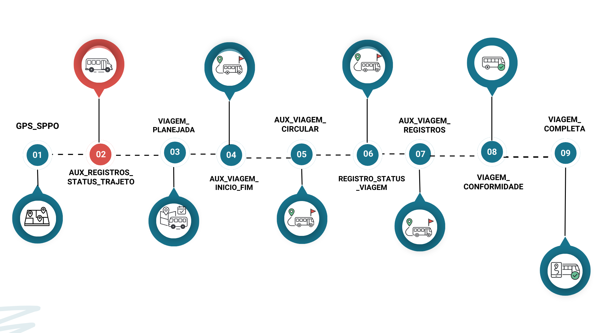
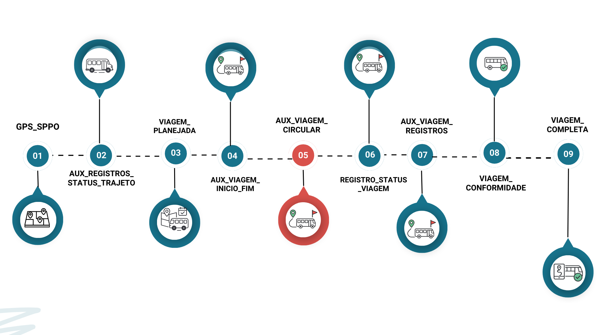
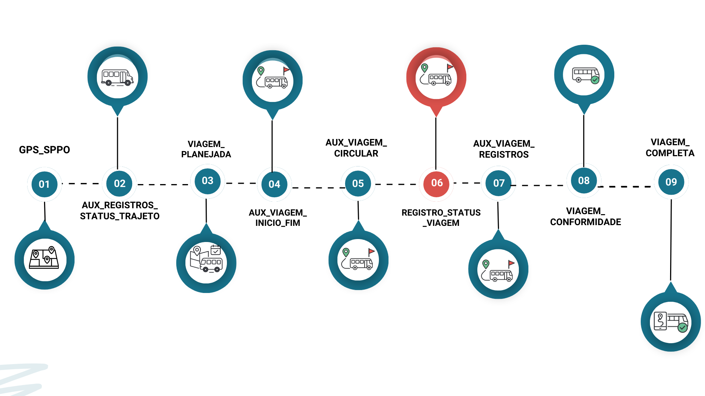
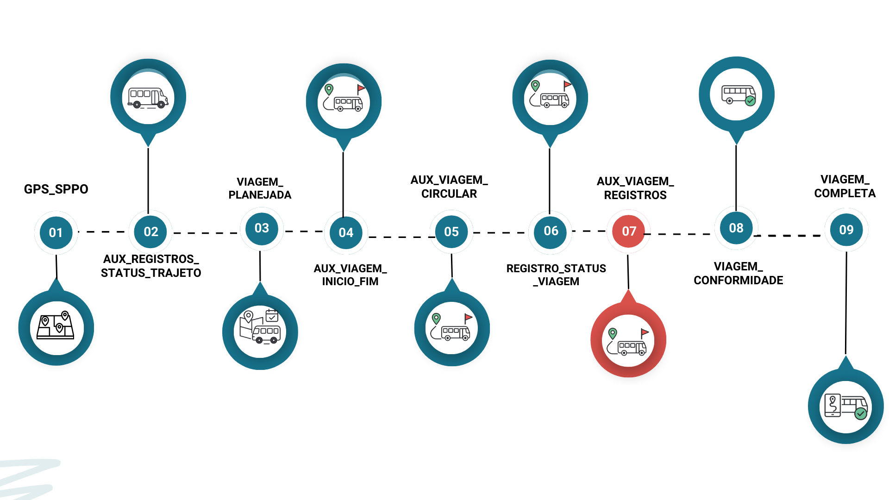
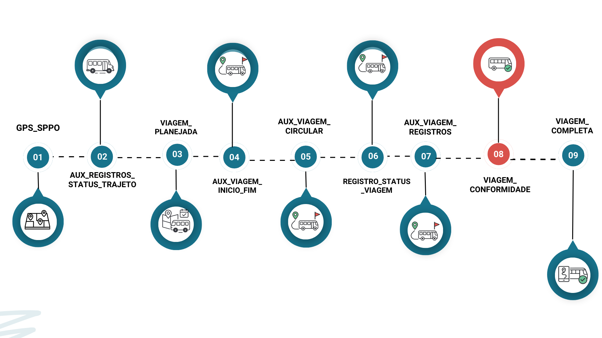
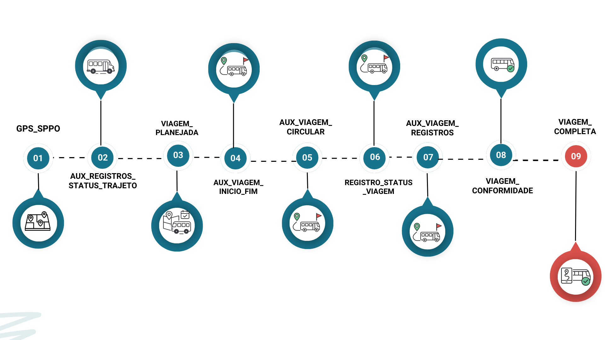

# Documentação consolidada do processo de apuração das viagens do transporte público municipal do Rio de Janeiro. 
*Inclui legislação, glossário, descrição dos modelos que são apresentados na sequência de execução da pipeline.*

------------------------------------------------------------------------------
------------------------------------------------------------------------------
# **Legislação**

## **2022** 

[RESOLUÇÃO SMTR Nº 3552, DE 12 DE SETEMBRO DE 2022](https://transportes.prefeitura.rio/wp-content/uploads/sites/31/2022/09/RESOLUC%CC%A7A%CC%83O-SMTR-No-3552-DE-12-DE-SETEMBRO-DE-2022.pdf)
   *  Dispõe sobre a metodologia de apuração de quilometragem realizada pelo Serviço Público de Transporte de Passageiros por Ônibus - SPPO a ser subsidiada pelo Município do Rio de Janeiro, de acordo com as premissas e requisitos estabelecidos no acordo judicial.

## **2023** 

[RESOLUÇÃO SMTR Nº 3591 DE 01 DE FEVEREIRO DE 2023](https://transportes.prefeitura.rio/wp-content/uploads/sites/31/2023/02/RESOLUCAO-SMTR-No-3592-DE-01-DE-FEVEREIRO-DE-2023.pdf) 

   * Art. 1º (...) A linha atingir 80% ou mais de conformidade com o planejado pela SMTR para a quilometragem do dia.

## **2024**

[RESOLUÇÃO SMTR Nº 3777 DE 11 DE OUTUBRO DE 2024](https://transportes.prefeitura.rio/wp-content/uploads/sites/31/2024/10/RESOLUCAO-SMTR-No-3777-DE-11-DE-OUTUBRO-DE-2024.pdf)

   * Altera a Resolução SMTR nº 3.529, de 13 de junho de 2022, para dispor sobre os percentuais mínimos e máximos de quilometragem percorrida e quadro de horários das linhas do Serviço Público de Transporte de Passageiros por Ônibus da Cidade do Rio de Janeiro - SPPO/RJ, em cumprimento ao Acordo Judicial da Ação Civil Pública Nº 0045547-94.2019.8.19.0001.

## **2025**

[DECRETO RIO Nº 55631 DE 1º DE JANEIRO DE 2025](https://transportes.prefeitura.rio/wp-content/uploads/sites/31/2025/01/DECRETO-RIO-No-55631-DE-1o-DE-JANEIRO-DE-2025-.pdf)

   * Art. 7º º Caso as concessionárias não atinjam a meta de 80% da quilometragem determinada pela SMTR por linha e por faixa horária, na forma do Acordo Judicial, além de não ser devido o subsídio por quilômetro rodado, será imposta uma penalidade caso haja redução da operação a patamares inferiores a 60% da quilometragem determinada pelo Município do Rio de Janeiro para cada linha do SPPO-RJ.

[RESOLUÇÃO SMTR Nº 3862, DE 11 DE JULHO DE 2025](https://transportes.prefeitura.rio/wp-content/uploads/sites/31/2025/07/RESOLUCAO-SMTR-No-3862-DE-11-DE-JULHO-DE-2025-Altera-a-SMTR-no-3.529-de-13-de-junho-de-2022.pdf)

   * Altera a SMTR nº 3.529, de 13 de junho de 2022, para dispor sobre os percentuais mínimos e máximos de quilometragem percorrida por sentido, e sobre a distribuição de faixas horárias na operação das linhas do Serviço Público de Transporte de Passageiros por Ônibus da Cidade do Rio de Janeiro - SPPO/RJ, em cumprimento à repactuação do Acordo Judicial da Ação Civil Pública Nº 0045547-94.2019.8.19.0001 celebrada em 30 de abril de 2025.

------------------------------------------------------------------------------
------------------------------------------------------------------------------
# **Glossário**
- **Distância aferida**: Cálculo da distância percorrida entre dois pontos de dados de GPS sucessivos;
- **Garagem**: Local onde os veículos de transporte ficam quando não estão em operação;
- **GTFS**: Arquivo contendo informações sobre linhas de ônibus e serviços de BRT da cidade do Rio de Janeiro. Atualizado mensalmente pela [Secretaria Municipal de Transportes](https://www.data.rio/datasets/8ffe62ad3b2f42e49814bf941654ea6c/about);
- **id_veiculo**: Identificação do veículo a partir de um número de ORDEM;
- **id_viagem**: Identificação única para cada viagem;
- **Modelo ephemeral e incremental**: Vide [DBT](https://docs.getdbt.com/docs/build/materializations);
- **Plano operacional**: Documento divulgado pela [Prefeitura](https://transportes.prefeitura.rio) que contém as características operacionais dos serviços;
- **Ponto**: Comunicação pontual do GPS;
- **Rota planejada**: Rota planejada para aquele tipo de serviço e sentido conforme o GTFS;
- **Rota realizada**: Rota realizada pelo veículo em determinado tipo de serviço, sentido, data, horário;
- **Serviço**: Codificação alfanumérica que possui itinerário pré-definido e especificação de quilometragem, também denominado LINHA;
- **Shape** - Elemento geométrico que representa o espaço em formato linestring ou multilinestring;
- **SPPO** - Sistema de transporte público por ônibus; 
- **Timestamp** - Registro de data e hora;
- **Viagem** - O percurso completo de um veículo, partindo de um ponto inicial e terminando em um ponto final, com determinado horário de início e término[duas meias viagens];
- **Viagem Circular** - Viagens que o início e o fim do trajeto possuem a mesma geolocalização. 
-----------------------------------------------------------------------
# **Modelos desta documentação**
- 

------------------------------------------------
# **ETAPA 1**

## **1. Tabela: `gps_sppo`** 
*Caminho do modelo:* 
*prefeitura_rio/pipelines_rj_smtr/queries/models/br_rj_riodejaneiro_veiculos/gps_sppo.sql*

- 

**1.1 Objetivo**: Armazenar os dados do gps após as transformações de dados que resultam no cálculo da velocidade instantânea, cálculo da velocidade média e análise da movimentação do veículo a fim de verificar se seu status é parado.

**1.2 Modelos utilizados**:  `sppo_aux_registros_filtrada`, `sppo_aux_registros_velocidade`, `sppo_aux_registros_parada`, `sppo_aux_registros_flag_trajeto_correto`, 

**1.3 Fluxo de execução do modelo**:
* Modelo Incremental particionado por data com granularidade diária;
* Realiza a junção dos tratamentos realizados no GPS;
* Filtra os dados brutos capturados;
* Identifica se os veículos estão "em operação" ou "operando fora do trajeto";
* Identifica se os veículos estão "parado fora do trajeto" ou "parado trajeto correto".

**1.4 Resultados apresentados**:
* A tabela `gps_sppo` apresenta cada linha como registro a cada 30 segundos da comunicação do GPS dos veículos particionado por data. Nesta tabela, constam os atributos:
   * Data (YYYY-mm-dd);
   * Hora (hh:mm:ss);
   * Id_veiculo;
   * Serviço (garagem ou determinada linha);
   * Dados de geolocalização latitude e longitude;
   * Tipo de parada (terminal ou garagem);
   * Flags com respostas booleanas (TRUE e FALSE): 
      * flag para verificar se o veículo está em operação, flag para verificar se o veículo está em movimento;
      * flag para verificar se o serviço existe no SIGMOB;
      * flag cujo objetivo é retornar se o veículo está no trajeto correto;
      * flag para verificar se veículo está no trajeto correto hist (10 minutos);
   * Status do veículo ("em operação" ou "operando fora do trajeto");
   * Velocidade instantânea;
   * Velocidade estimada nos últimos 10 minutos;
   * Distância calculada entre cada registro;
   * Versão.       

**1.5 Observaçoes**: Indicador de conformidade em rota com o SIGMOB foi descontinuado.

**1.6 Linhagem**
- 

**1.7 Modelo da Tabela**

------------------------------------------------------------------------------

------------------------------------------------
# **ETAPA 2**

## **2. Tabela: `Aux_registros_status_trajeto`** 
*Caminho do modelo:* 
*prefeitura_rio/pipelines_rj_smtr/queries/models/projeto_subsidio_sppo/aux_registros_status_trajeto.sql*

- 

**2.1 Objetivo**: Monitorar e classificar a posição dos veículos de transporte público em relação às suas rotas planejadas

         
**2.2 Fluxo de execução do modelo**:
* Materialização declarada no arquivo dbt_project.yml 
* Busca o GTFS vigente;
* Filtra registros da Tabela gps_sppo com o critério d-2;
* Remove os veículos parados em garagem;
* Associa o serviço com base no informado;
* Utiliza a função [ST_GEOGPOINT](https://cloud.google.com/bigquery/docs/reference/standard-sql/geography_functions) para criar um ponto georreferenciado;
* Utiliza a função [ST_DWINTHIN](https://cloud.google.com/bigquery/docs/reference/standard-sql/geography_functions) para verificar se a posição do veículo está dentro do planejado;
* Gera um buffer de 500 metros que define o quanto o veículo precisa estar próximo a rota para que o trajeto seja considerado válido;
*  Classifica o registro do GPS em indicadores de posição:
   * start: o veículo está próximo ao início da rota.
   * middle: a viagem e o veículo recebem o status de middle a partir da primeira comunicação depois do buffer inicial (start).
   * end: o veículo encontra-se próximo ao final da rota
   * out: veículo fora da rota.
   * *Modelo esquemático*:

                  
**2.3 Resultados apresentados** 
* A tabela `aux_registros_status_trajeto` apresenta cada linha como registro de comunicação do GPS a cada 30 segundos dos veículos particionado por data. Nesta tabela, constam os atributos:
   * Data (YYYY-mm-dd);
   * Id_veiculo;
   * Id_empresa;
   * Timestamp_gps com a hora contendo os segundos;
   * Timestamp_minuto_GPS contendo apenas hora e minuto;
   * Posicao_veiculo_geo, onde constam os dados de geolocalização do veículo em formato WKT POINT;  
   * Serviço informado;
   * Serviço realizado;
   * Shape_id;
   * Sentido da Shape (ida "I" ou volta "V");
   * Shape id_planejado;
   * Trip id;
   * Trip planejado;
   * Sentido;
   * Start_pt onde são armazenadas a geolocalização do ponto inicial da rota;
   * End_point onde são armazenadas a geolocalização do ponto final da rota;
   * Distância planejada;
   * Distância realizada;
   * Status da viagem, com a informação se aquele registro está no start middle, end ou out com relação a rota; 
   * Versão.   

**2.4 Linhagem**

**2.5 Modelo da Tabela**

------------------------------------------------------------------------------
------------------------------------------------------------------------------
# **ETAPA 3**

## **3. Tabela: `viagem_planejada`** 
*Caminho do modelo:* 
*prefeitura_rio/pipelines_rj_smtr/queries/models/projeto_subsidio_sppo/viagem_planejada.sql*

- 

**3.1 Objetivo**: Criar uma tabela unificada de viagens planejadas.
         
**3.2 Fluxo de execução do modelo**:
* Materização incremental
* Uni as tabelas de `viagem_planejada_v1` e `viagem_planejada_v2`.
                  
**3.3 Resultados apresentados**
* A tabela `viagem_planejada` apresenta cada linha como registro com os seguintes atributos:
   * data (YYYY-mm-dd);
   * tipo_dia, especificação quanto ao dia útil, sábado, domingo, feriado, dias atípicos;
   * servico;
   * vista que trata do nome do itinerário;
   * consorcio;
   * sentido (Ida/Volta);
   * partida_total_planejada que traz quantas partidas estão especificadas;
   * distancia_planejada por viagem;
   * distância_total para o dia;
   * Início do período;
   * Fim do Período;
   * Faixa Horária Início;
   * Faixa Horária Fim;
   * Trip id planejado;
   * Trip id;
   * Shape id;
   * Shape id planejado;
   * Data_shape;
   * Shape (em formato multilinestring);
   * Sentido_shape;
   * Start_pt, ponto de início da viagem;
   * End_pt, ponto final da viagem;
   * Id_tipo_trajeto;
   * Feed Version;
   * Feed Start Date;
   * Datetime da última atualização;
   * Id_execucao_dbt.

**3.4 Linhagem**:

**3.5 Modelo da Tabela**

 
 
 

------------------------------------------------------------------------------
------------------------------------------------------------------------------
# **ETAPA 4**

## **4. Tabela: `aux_viagem_inicio_fim`** 
*Caminho do modelo:* 
*prefeitura_rio/pipelines_rj_smtr/queries/models/projeto_subsidio_sppo/aux_viagem_inicio_fim.sql*

**4.1 Objetivo**: Identifica partida e chegada das viagens.
         
**4.2 Fluxo de execução do modelo**:
* A Tabela é uma *View*;
* Cria coluna identificadora para início (start) e fim (end) da viagem;
* Coloca no mesmo registro início e o fim da viagem, e posições geográficas de início e fim, utilizando a função [LEAD](https://cloud.google.com/bigquery/docs/reference/standard-sql/navigation_functions#lead);
* Cria um id único para a viagem, utilizando o id_veiculo, serviço realizado, sentido, shape_id_planejado e datetime_partida;
* Calcula a distância entre a posição inicial e final por meio da função [ST_DISTANCE](https://cloud.google.com/bigquery/docs/reference/standard-sql/geography_functions#st_distance), transformando a distância em metros.
                  
**4.3 Resultados apresentados**

Transforma a sequência de pontos do GPS em uma viagem com data e hora, posição inicial e final, distância real e planejada e cria um id único com o objetivo de fornecer insumos para a Tabela `viagem_conformidade`, com os seguintes atributos:
   * id_viagem;
   * data;
   * id_empresa;
   * id_veiculo;
   * servico_informado;
   * servico_realizado;
   * trip_id;
   * shape_id;
   * sentido_shape;
   * distancia_inicio_fim;
   * distancia_planejada;
   * shape_id_planejado;
   * trip_id_planejado;
   * sentido;
   * datetime_partida;
   * datetime_chegada;
   * versao_modelo.

**4.4 Linhagem**

------------------------------------------------------------------------------
------------------------------------------------------------------------------
# **ETAPA 5**

## **5 Tabela: `aux_viagem_circular`** 
*Caminho do modelo:* 
 *prefeitura_rio/pipelines_rj_smtr/queries/models/projeto_subsidio_sppo/aux_viagem_circular.sql*

- 

**5.1 Objetivo**: Identificar viagens de ida que possuem volta subsequente. 

**5.2 Fluxo de execução do modelo**:
* Trata-se de uma *View*
* Utiliza a função [LEAD](https://cloud.google.com/bigquery/docs/reference/standard-sql/navigation_functions#lead) para inserir em mesmo registro o datetime ida e o datetime volta;
* Atribui um id_viagem unificando ida e volta.

**5.3 Resultados apresentados**
A tabela apresenta os seguintes atributos:
   * id_viagem;
   * data;
   * id_empresa;
   * id_veiculo;
   * servico_informado;
   * servico_realizado;
   * trip_id;
   * shape_id;
   * sentido_shape;
   * distancia_inicio_fim;
   * distancia_planejada;
   * shape_id_planejado;
   * trip_id_planejado;
   * sentido;
   * datetime_partida;
   * datetime_chegada;
   * versao_modelo.

**5.4 Linhagem**:

-----------------------------------------------------------------------------
------------------------------------------------------------------------------
# **ETAPA 6**

## **6 Tabela: `registros_status_viagem`** 
*Caminho do modelo:* 
*prefeitura_rio/pipelines_rj_smtr/queries/models/projeto_subsidio_sppo/registros_status_viagem.sql*

**6.1 Objetivo**: Filtrar apenas viagens identificadas a partir dos modelos `aux_registros_status_trajeto`e `aux_viagem_circular`. 

**6.2 Fluxo de execução do modelo**:
* Materialização incremental com partição diária;
* Faz um join entre as tabelas `aux_registros_status_trajeto`e `aux_viagem_circular`
                  
**6.3 Resultados apresentados**
* A tabela `registros_status_viagem` apresenta cada linha como registro com os seguintes atributos:
   * data (YYYY-mm-dd);
   * id_veiculo;
   * id_empresa;
   * timestamp_gps
   * timestamp_minutos que desconsidera os segundos do timestamp_gps;
   * Posição georreferenciada do veículo;
   * Serviço informado;
   * Serviço realizado;
   * Shape_id;
   * Sentido Shape (Ida 'I' e Volta 'V');
   * Shape id_planejado;
   * Trip_id;
   * Trip_id planejado;
   * Sentido (Ida 'I' e Volta 'V');
   * Start_pt ponto de início georreferenciado;
   * End_pt ponto de fim da viagem georreferenciado;
   * Distância_planeada;
   * Distância (realizada);
   * Status da viagem (start, middle, end, out);
   * Datetime_partida;
   * Datetime_chegada;
   * Distancia_Inicio_Fim;
   * id_viagem;
   * Versao_modelo

**6.4 Linhagem**:

**6.5 Modelo da Tabela**

 
 
 

-----------------------------------------------------------------------------
------------------------------------------------------------------------------
# **ETAPA 7**

## **7 Tabela: `aux_viagem_registros`** 
*Caminho do modelo:* 
*prefeitura_rio/pipelines_rj_smtr/queries/models/projeto_subsidio_sppo/aux_viagem_registros.sql*

**7.1 Objetivo**: Somar a quantidade total de registros de GPS.
         
**7.2 Fluxo de execução do modelo**:
* Trata-se de uma *View*.
* Conta quantos registros ocorreram em start, middle e end;
* Calcula a distância total.

**7.3 Resultados apresentados**
* A tabela `aux_viagem_registros` apresenta indicadores por viagem com a distância aferida, pontos de gps por fase (start, middle, end e out) e quantos minutos tiveram registros de gps, com os seguintes atributos:
   * id_viagem;
   * distancia_aferida;
   * distancia_Inicio_Fim;
   * n_registros_middle (os números de registros quando o veículo está na posição middle)
   * n_registros_start (os números de registros quando o veículo está na posição start)
   * n_registros_end (os números de registros quando o veículo está na posição end)
   * n_registros_out (os números de registros quando o veículo está na posição out, fora da rota)
   * n_registros_total(o número total de registros)
   * n_registros_minuto (o número total de registro por minuto)
   * n_registros_shape (o número total de registros que interccionam a shape)
   * Versao_modelo

 
**7.4 Linhagem**:

-----------------------------------------------------------------------------
------------------------------------------------------------------------------
# **ETAPA 8**

## **8 Tabela: `Viagem_conformidade`** 
*Caminho do modelo:* 
*prefeitura_rio/pipelines_rj_smtr/queries/models/projeto_subsidio_sppo/viagem_conformidade.sql*

- 

**8.1 Objetivo**: Calcular o tempo total de viagem, os percentuais de conformidade de distância e os registros no shape.
         
**8.2 Fluxo de execução do modelo**:
* Materialização incremental com particionamento por data e granularidade diária;
* Calcula o percentual de conformidade do shape, dividindo o registro do shape pelos registros totais;
* Calcula o percentual de conformidade da distância, dividindo a distância aferida pela distância planejada;
* Calcula o percentual de conformidade de registros da comunicação do gps ao dividir o número de registros por minuto pelo tempo total da viagem.

**8.3 Resultados apresentados**
* A tabela `Viagem_conformidade` apresenta:
   * Id_viagem;
   * Data (YYYY-mm-dd);
   * Id_empresa;
   * Id_veiculo;
   * Serviço informado;
   * Serviço realizado;
   * Distância planejada;
   * Sentido (ida "I", volta "V");
   * Datetime_partida
   * Datetime_chegada
   * Trip_id;
   * Shape_id;
   * Tempo_viagem (em minutos);
   * Distancia_aferida (metros);
   * Distancia_inicio_fim (quilometros);
   * n_registros_middle (os números de registros quando o veículo está na posição middle);
   * n_registros_start (os números de registros quando o veículo está na posição start);
   * n_registros_end (os números de registros quando o veículo está na posição end);
   * n_registros_total(o número total de registros);
   * n_registros_minuto (o número total de registro por minuto);
   * n_registros_shape (o número total de registros que interccionam a shape);
   * Velocidade média;
   * E os percentuais de conformidade:
      * conformidade_shape;
      * conformidade_distância;
      * conformidade_registros.

 
**8.4 Linhagem**

**8.5 Modelo da Tabela**

 
 

------------------------------------------------------------------------------
------------------------------------------------------------------------------

# **ETAPA 9**

## **9 Tabela: `Viagem_completa`** 
*Caminho do modelo:* 
*prefeitura_rio/pipelines_rj_smtr/queries/models/projeto_subsidio_sppo/viagem_completa.sql*

- 

**9.1 Objetivo**: Consolidar as viagens e apresentação dos indicadores.
                  
**9.2 Fluxo de execução do modelo**:
* Materialização incremental com partição diária; (PADRONIZAR)
* Identifica as viagens que estão dentro do `viagem_planejada`;
* Filtra apenas as viagens que atendem aos percentuais mínimos de conformidade;
* Faz a associação de serviço informado e serviço realizado;
* Filtra as viagens com velocidade média acima de 110km/h (A partir de 16/11/2024);
* Utiliza as funções:
   * [ST_BUFFER](https://cloud.google.com/bigquery/docs/reference/standard-sql/geography_functions#st_bufferwithtolerance) para criar um ponto em volta do start (ponto que a viagem se inicia);
   * [ST_INTERSECTION](https://cloud.google.com/bigquery/docs/reference/standard-sql/geography_functions#st_intersection) para cruzar a área com o shape;
   * [ST_NUMGEOMETRIES](https://cloud.google.com/bigquery/docs/reference/standard-sql/geography_functions#st_numgeometries) verifica se o buffer interccionou com o shape em pelo menos um registro.
   * Analisa se os percentuais de conformidade estão dentro dos mínimos declarados no dbt_project;
   * Possibilita ajuste no modelo diante de atipicidade, como shows, reveillon, etc. 

**9.3 Resultados apresentados**
* A tabela `Viagem_completa` apresenta a consolidação de todas as informações e possui os seguintes atributos:
   * Consórcio;
   * Data (YYYY-mm-dd);
   * Tipo de dia (útil, sábado, domingo, ponto facultativo, atípico);
   * Id_empresa;
   * Id_veiculo;
   * Id_viagem;
   * Serviço informado;
   * Serviço realizado;
   * Vista que são strings com os nomes das localidades iniciais e finais atendimento;
   * Trip_id;
   * Shape_id;
   * Datetime_partida, ou seja, o horário que a viagem iniciou;
   * Datetime_chegada, ou seja, o horário que a viagem finalizou;
   * Início do período da faixa horária;
   * Fim do período da faixa horária;
   * Tipo_viagem (Exemplo: "Completa Linha correta" ou "Completa linha incorreta");
   * Tempo_viagem;
   * Tempo_planejado;
   * Distancia_planejada (quilometros);
   * Distancia_aferida em (quilometros);
   * Sentido (ida "I", volta "V");
   * n_registros_shape (o número total de registros que interccionam a shape);
   * n_registros_total(o número total de registros);
   * n_registros_minuto (o número total de registro por minuto);
   * Velocidade média;
   * E os percentuais de conformidade:
      * perc_conformidade_shape;
      * perc_conformidade_distância;
      * perc_conformidade_registros;
      * perc_conformidade_tempo.
   * Datetime com a última atualização;
   * Versao_modelo.

 
**9.4 Linhagem**

**9.5 Modelo da Tabela**

 
 
 
 

------------------------------------------------------------------------------
------------------------------------------------------------------------------
# **REFERENCIAS**

- [Documentação DBT Rio](https://docs.mobilidade.rio/#!/overview?g_v=1&g_i=%2Bviagem_completa);
- [Função ST_DISTANCE](https://cloud.google.com/bigquery/docs/reference/standard-sql/geography_functions#st_distance);
- [Função ST_DWITHIN](https://cloud.google.com/bigquery/docs/reference/standard-sql/geography_functions#st_dwithin);
- [Função ST_INTERSECTBOX](https://cloud.google.com/bigquery/docs/reference/standard-sql/geography_functions);
- [Função ST_GEOGFROMTEXT](https://cloud.google.com/bigquery/docs/reference/standard-sql/geography_functions#st_geogfromtext);
- [Função ST_GEOGPOINT](https://cloud.google.com/bigquery/docs/reference/standard-sql/geography_functions#st_geogpoint)
- [Função LAG](https://cloud.google.com/bigquery/docs/reference/legacy-sql?hl=pt-br);
- [Função LEAD](https://cloud.google.com/bigquery/docs/reference/legacy-sql?hl=pt-br);
- [Função WINDOW](https://cloud.google.com/bigquery/docs/reference/standard-sql/window-function-calls);
- [GTFS Rio](https://www.data.rio/datasets/8ffe62ad3b2f42e49814bf941654ea6c/about);
- [Materialização de modelos Incremental e Ephemeral DBT](https://docs.getdbt.com/docs/build/materializations);
- [Plano Operacional](https://transportes.prefeitura.rio).

------------------------------------------------------------------------------
------------------------------------------------------------------------------
## Disposições Finais e Critérios de Precedência Normativa

Este documento possui caráter meramente técnico-descritivo, destinado a detalhar, de forma didática, os procedimentos, fluxos de dados, parâmetros e indicadores utilizados pela Secretaria Municipal de Transportes para a apuração de viagens e quilometragem do SPPO/RJ.

Em hipótese alguma este documento substitui, altera ou modifica as disposições contidas na legislação municipal, em normas regulamentares, em decisões judiciais ou em atos administrativos vigentes, nem o modelo computacional oficial parametrizado pela SMTR.

Para todos os efeitos legais e operacionais, em caso de divergência ou inconsistência entre as informações aqui descritas e:

A legislação vigente (leis, decretos, resoluções e demais normas aplicáveis), prevalecerá a legislação;
O modelo computacional oficial utilizado na produção da base viagem_completa e demais artefatos publicados no repositório oficial da [SMTR](https://github.com/prefeitura-rio/pipelines_rj_smtr), prevalecerá o resultado gerado por este modelo;
Este documento, que será interpretado como instrumento complementar, com função de apoio e transparência, não vinculando a Administração em detrimento das normas e modelos oficiais.

Eventuais ajustes ou atualizações técnicas na pipeline poderão ser implementados e refletidos no modelo oficial, observando-se sempre os parâmetros definidos em norma e os princípios de legalidade, publicidade e transparência administrativa.

