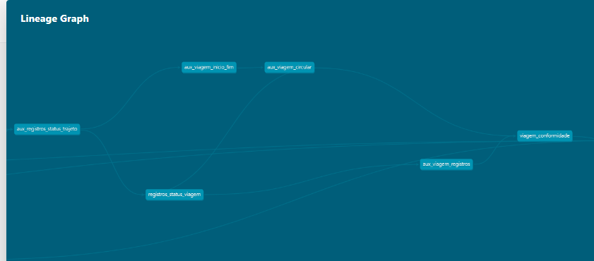
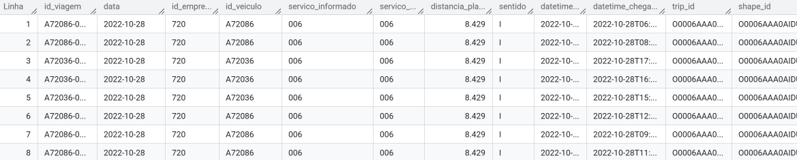
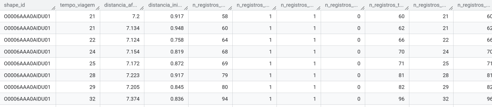
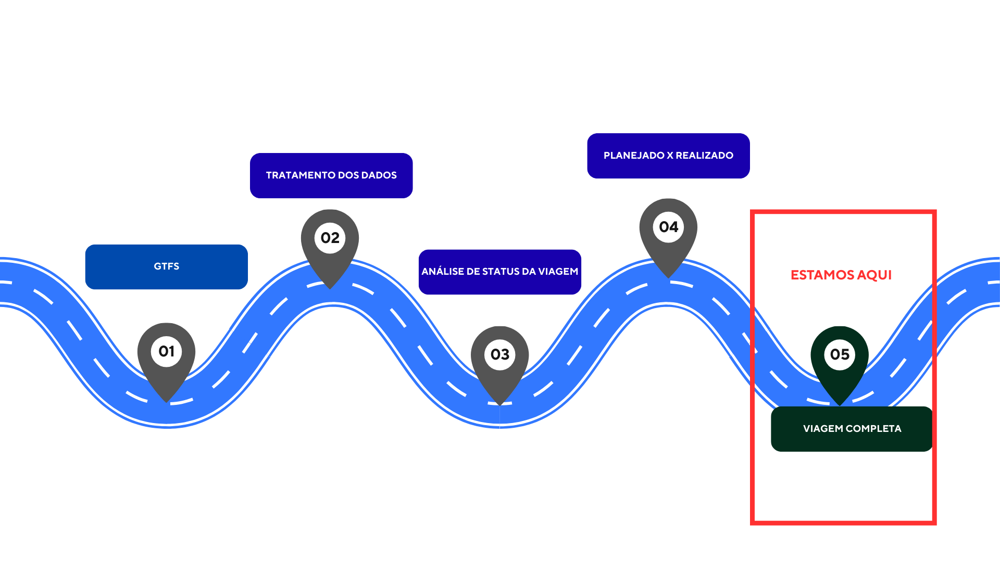
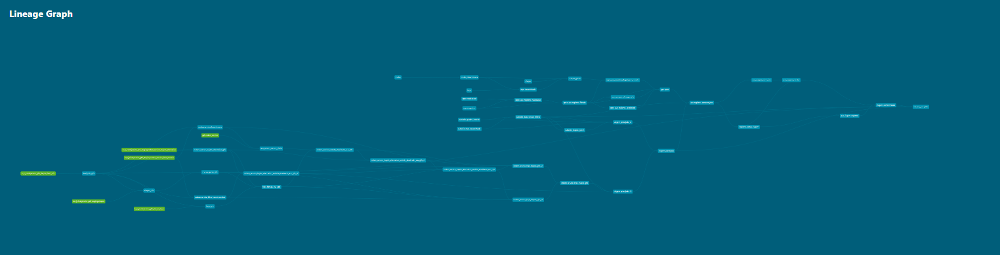
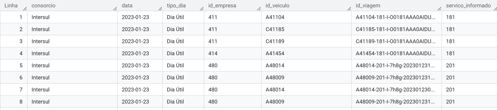
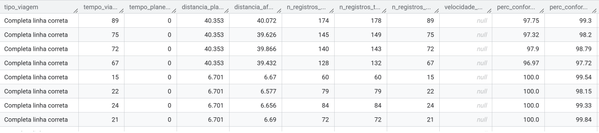
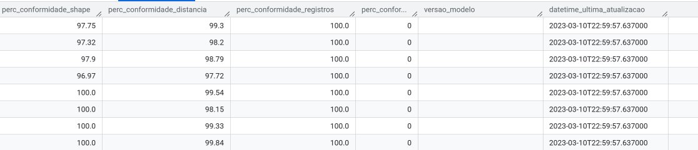

# Documentação consolidada do processo de apuração das viagens do transporte público municipal do Rio de Janeiro. 
*Inclui glossário, descrição dos modelos que são apresentados na sequência de execução da pipeline.*

------------------------------------------------------------------------------
------------------------------------------------------------------------------
## **Glossário:**
- **Distância aferida**: Cálculo da distância percorrida entre dois pontos de dados de GPS sucessivos;
- **Garagem**: Local onde os veículos de transporte ficam quando não estão em operação;
- **GTFS**: Arquivo contendo informações sobre linhas de ônibus e serviços de BRT da cidade do Rio de Janeiro. Atualizado mensalmente pela Secretaria Municipal de Transportes <https://www.data.rio/datasets/8ffe62ad3b2f42e49814bf941654ea6c/about>;
- **id_veiculo**: Identificação do veículo a partir de um número de ORDEM;
- **id_viagem**: Identificação única para cada viagem;
- **Modelo ephemeral e incremental**: Vide DBT (<https://docs.getdbt.com/docs/build/materializations>);
- **Plano operacional**: Documento divulgado pelo site <https://transportes.prefeitura.rio> que contém as características operacionais dos serviços;
- **Ponto**: Comunicação pontual do GPS;
- **Rota planejada**: Rota planejada para aquele tipo de serviço e sentido conforme o GTFS;
- **Rota realizada**: Rota realizada pelo veículo em determinado tipo de serviço, sentido, data, horário;
- **Serviço**: Codificação alfanumérica que possui itinerário pré-definido e especificação de quilometragem, também denominado LINHA;
- **Shape** - Elemento geométrico que representa o espaço em formato linestring ou multilinestring;
- **Timestamp** - Registro de data e hora;
- **Viagem** - O percurso completo de um veículo, partindo de um ponto inicial e terminando em um ponto final, com determinado horário de início e término[duas meias viagens];
- **Viagem Circular** - Viagens que o início e o fim do trajeto possuem a mesma geolocalização. 
-----------------------------------------------------------------------
## MODELOS DESTA DOCUMENTAÇÃO
- 

------------------------------------------------
## **ETAPA 1**

## **1. Tabela: gps_sppo** 
*Caminho do modelo:* 
*prefeitura_rio/pipelines_rj_smtr/queries/models/br_rj_riodejaneiro_veiculos/gps_sppo.sql*

- 

**1.1 Objetivo**: Armazenar os dados do gps após as transformações de dados que resultam no cálculo da velocidade instantânea, cálculo da velocidade média e análise da movimentação do veículo a fim de verificar se seu status é parado.

**1.2 Modelos utilizados**:  `sppo_aux_registros_filtrada`, `sppo_aux_registros_velocidade`, `sppo_aux_registros_parada`, `sppo_aux_registros_flag_trajeto_correto`, 

**1.3 Fluxo de execução do modelo**:
* Modelo Incremental particionado por data com granularidade diária;
* Realiza a junção dos tratamentos realizados no GPS;
* Filtra os dados brutos capturados;
* Identifica se os veículos estão "em operação" ou "operando fora do trajeto";
* Identifica se os veículos estão "parado fora do trajeto" ou "parado trajeto correto".

**1.4 Resultados apresentados**:
* A tabela gps_sppo apresenta cada linha como registro a cada 30 segundos da comunicação do GPS dos veículos particionado por data. Nesta tabela, constam os atributos:
   * Data (YYYY-mm-dd);
   * Hora (hh:mm:ss);
   * Id_veiculo;
   * Serviço (garagem ou determinada linha);
   * Dados de geolocalização latitude e longitude;
   * Tipo de parada (terminal ou garagem);
   * Flags com respostas booleanas (TRUE e FALSE): 
      * flag para verificar se o veículo está em operação, flag para verificar se o veículo está em movimento;
      * flag para verificar se o serviço existe no SIGMOB com resposta FALSE devido a descontinuação desse atributo;
      * flag cujo objetivo é retornar se o veículo está no trajeto correto;
      * flag para verificar se veículo está no trajeto correto hist
   * Status do veículo ("em operação" ou "operando fora do trajeto");
   * Velocidade instantânea;
   * Velocidade estimada nos últimos 10 minutos;
   * Distância calculada entre cada registro;
   * Versão.       

**1.5 Observaçoes**: Indicador de conformidade em rota com o SIGMOB foi descontinuado.

**1.6 Linhagem**:
- 

**2.5 Modelo da Tabela**:

------------------------------------------------------------------------------
------------------------------------------------------------------------------
## ETAPA 3
- 

## **3. Aux_registros_status_trajeto**
 - Caminho do modelo: prefeitura_rio/pipelines_rj_smtr/queries/models/projeto_subsidio_sppo/aux_registros_status_trajeto.sql
         
**3.1 Objetivo**: Monitorar e classificar a posição dos veículos de transporte público em relação às suas rotas planejadas
         
**3.2 Fluxo de execução do modelo**:
* *Materização*: Não declarada;
* *Busca o GTFS* vigente;
* *Filtra* registros da Tabela gps_sppo com o critério d-2;
* *Remove* os veículos parados em garagem;
* *Correspondência do tipo de serviço*, o modelo analisa que se o serviço informado via GPS está igual ao serviço planejado; 
* *Utiliza a função ST_GEOGPOINT* para criar um ponto georreferenciado. [vide documentação <https://cloud.google.com/bigquery/docs/reference/standard-sql/geography_functions>];
* *Utiliza a função ST_DWINTHIN* para verificar se a posição do veículo está dentro do planejado;
* *Gera um buffer* define o quanto o veículo precisa estar próximo a rota para que o trajeto seja considerado válido. Dentro de um buffer de 500 metros;
*  *Classifica* o registro do GPS em start, middle e end. 
*  *Indicador de posição:*
   * start: o veículo está próximo ao início da rota.
   * middle: a viagem e o veículo recebem o status de middle a partir da primeira comunicação depois do buffer inicial (start).
   * end: o veículo encontra-se próximo ao final da rota
   * out: veículo fora da rota.

* *Modelo* esquemático:

                  
**3.3 Resultados apresentados**
- Classifica o registro do GPS.

**3.4 Linhagem**:
- 

* **3.5 Modelo da Tabela**:
- 

------------------------------------------------------------------------------
------------------------------------------------------------------------------
## ETAPA 4
- 

## **4. Viagem Planejada**
*Caminho do modelo:*  prefeitura_rio/pipelines_rj_smtr/queries/models/projeto_subsidio_sppo/viagem_planejada.sql
**4.1 Objetivo**: Criar uma tabela unificada de viagens planejadas.

**4.2 Fluxo de execução do modelo**:
* *Materização*: Incremental.
  
**4.3 Resultados apresentados**
- Tabela unificada com os dados de viagens planejadas.
  
**4.4 Linhagem**:
- 

**4.5 Modelo da Tabela**:
- 

------------------------------------------------------------------------------
## **5. Aux_viagem_inicio_fim**
*Caminho do modelo*: prefeitura_rio/pipelines_rj_smtr/queries/models/projeto_subsidio_sppo/aux_viagem_inicio_fim.sql
         
**5.1 Objetivo**: Elabora um parâmetro das viagens completas (partida e chegada) de cada veículo no shape planejado.

**5.2 Fluxo de execução do modelo**: 
* *Materização*: Não declarada;
* *Analisa* se há diferença entre duas classificações de registro de GPS, próximo registro do GPS for middle, então o anterior é o início da viagem, se mudar o status de middle, então tem-se o fim da viagem;
* *startend* um padrão para detectar se a viagem é curta;
* *Função lead* cada registro de partida é pareado com o seu próximo registro de chegada na mesma linha, guardando também suas posições geográficas. [Vide documentação para função Lead <https://learn.microsoft.com/pt-br/sql/t-sql/functions/lead-transact-sql?view=sql-server-ver16>];
* *Cria um id único* para a viagem;
* *Calcula* a distância entre o planejado e o real usando a função st_distance ao selecionar o ponto inicial e o ponto final. [Vide documentação <https://learn.microsoft.com/pt-br/stream-analytics-query/st-distance>] Além disso, faz uma divisão por mil para transformar metros em quilometros e arredonda para três casas decimais.
      
**5.3 Resultados apresentados**
- Transforma a sequência de pontos do GPS em uma viagem com data e hora, posição inicial e final, distância real e planejada e cria um id único com o objetivo de fornecer insumos para a Tabela Viagem em conformidade.

**5.4 Linhagem**:
- 

------------------------------------------------------------------------------
## **6. Tabela: registros_status_viagem**
*Caminho do modelo:* prefeitura_rio/pipelines_rj_smtr/queries/models/projeto_subsidio_sppo/registro_status_viagem.sql
         
**6.1 Objetivo**: Filtrar os registros de GPS e selecionar apenas aqueles que fazem parte de viagens realizadas que tenha um  início e um fim.
         
**6.2 Fluxo de execução do modelo**:
* *Materização*: Incremental com granularidade diária;
* *Id_veiculo + horário e data(timestamp)* são a chave;
* *Unifica* a tabela inicio e fim com a aux_circular (item 7).
       
**6.3 Resultados apresentados**
- Transforma os registros de GPS em uma base com os registros de viagem realmente realzadas.

**6.4 Linhagem**:
- 

**6.5 Modelo da Tabela**:
- 

------------------------------------------------------------------------------
## **7. Aux_viagem_circular**
 - *Caminho do modelo:* prefeitura_rio/pipelines_rj_smtr/queries/models/projeto_subsidio_sppo/aux_viagem_circular.sql
         
**7.1 Objetivo**: Identificar as viagens circulares de ida e volta.
         
**7.2 Fluxo de execução do modelo**:
* *Materização*: Não declarada;
* *Usa a função lead* para encontrar as viagens de ida que são imediatamente seguidas por uma de volta quando há um mesmo serviço e veículo. [Vide documentação para função Lead <https://learn.microsoft.com/pt-br/sql/t-sql/functions/lead-transact-sql?view=sql-server-ver16>];
* *Reatribui um novo id_viagem* para ida e para volta;
* *Junta* todas as viagens.
       
**7.3 Resultados apresentados**
- Gera uma tabela consolidada com as viagens circulares de ida e volta que possuem um mesmo id_viagem e combina com as demais viagens que não são circulares.

**7.4 Linhagem**:
- 

------------------------------------------------------------------------------
## **8. Aux_viagem_registros**
 - *Caminho do modelo:* prefeitura_rio/pipelines_rj_smtr/queries/models/projeto_subsidio_sppo/aux_viagem_registros.sql
         
**8.1 Objetivo**: Consolidar a quilomentragem das viagens.
         
**8.2 Fluxo de execução do modelo**:
* *Materização*: Não declarada;
* * *CTE distancia* para calcular a distancia percorrida, somando todas as distancias de todos os trechos e converte em quilometro. Em max(distancia_inicio_fim) inclui um gap, considerando o primeiro sinal de gps e o ponto inicial do shape e o último sinal do gps como o ponto final e arredonda para três casas;
* * *Conta o registro* das comunicações criando a instância n_registros_total e cria também a n_registros_minuto para não contar dois registros que foram emitidos no mesmo minuto;
* * *CTE filtro de datas* que verifica um ou dois dias de dados.
  * Essa parte do modelo faz essa análise dos dias:
             data = date_sub(date("{{ var("run_date") }}"), interval 1 day)
            
            data between date_sub(date("{{ var("run_date") }}"), interval 1 day) and date("{{ var("run_date") }}")
            
* *CTE consolidação final* agrupa pelo id_viagem e consolida os cálculos de distância e refistros de gps. 
       
**8.3 Resultados apresentados**
- Elabora indicadores por viagem com a distância aferida, pontos de gps por fase (start, middle, end e out) e quantos minutos tiveram registros de gps.

**8.4 Linhagem**:
- 
------------------------------------------------------------------------------
## **9. Viagem_conformidade**
 - *Caminho do modelo:* prefeitura_rio/pipelines_rj_smtr/queries/models/projeto_subsidio_sppo/viagem_conformidade.sql
         
**9.1 Objetivo**: Calcular os indicadores de conformidade entre as viagens planejadas e as viagens realizadas.
         
**9.2 Fluxo de execução do modelo**:
* *Materização*: Incremental;
* * *CTE viagens* realiza o calculo de quatro indicadores, sendo eles:
  * * perc_conformidade_shape que se trata do percentual de pontos do GPS dentro do trajeto planeado (pontos_no_trajeto / total_pontos) * 100
  * * perc_conformidade_distancia que se trata do percentual da distância real versus a planejada. (distancia_real / distancia_planejada) * 100
  * * perc_conformidade_registros que se trata do percentual de minutos com registros de GPS. (minutos_com_gps / tempo_total) * 100
  * * velocidade média que é calculado a partir da divisão da distância pelo tempo. 
          
**9.3 Resultados apresentados**
- Elabora uma tabela com os indicadores das viagens.

**9.4 Linhagem**:
- 

**9.5 Modelo da Tabela**:
- 
- 
------------------------------------------------------------------------------
------------------------------------------------------------------------------
# ETAPA 5
- 

## **10. Viagem Completa**
- *Caminho do modelo:* prefeitura_rio/pipelines_rj_smtr/queries/models/projeto_subsidio_sppo/viagem_completa.sql
         
**10.1 Objetivo**: Consolidação das viagens com a apresentação dos indicadores.
         
**10.2 Fluxo de execução do modelo**:
* *Materização*: Incremental com granularidade diária;
* *No primeiro bloco* do modelo é feita uma análise de versões de shapes válidos. A partir da variável  subsidio_data_versao_efetiva roda o dia anterior para selecionar a tabela shapes_geom_gtfs;
* *Seleciona as viagens plenejadas* e as viagens realizadas, realizando um filtro de horário;
* *Seleciona as viagens completas* desde que tenham um percentual de comunicação dentro do shape, que tenha uma distância aferida dentro do critério que foi planejado (80%);
* *Exceções* como o show da Madonna são tratadas com regras diferentes;
* *Retira as duplicidades*.
         
**10.3 Resultados apresentados**
         * Tabela unificada em que cada linha é uma viagem válida com dados de id, data, consórcio e com os indicadores de conformidade distancia_planejada, distancia_aferida, velocidade_media, perc_conformidade_shape, perc_conformidade_distancia e perc_conformidade_registros.
         
**10.4 Linhagem**:
- 

**10.5 Modelo da Tabela**:
- 
- 
- 
- 
------------------------------------------------------------------------------
------------------------------------------------------------------------------
## **REFERENCIAS**

- DBT <https://learn.getdbt.com/courses/dbt-fundamentals>;
- Documentação DBT Rio <https://docs.mobilidade.rio/#!/overview?g_v=1&g_i=%2Bviagem_completa>;
- Documentação GITHUB <https://docs.github.com/pt>
- Função ST_DISTANCE <https://learn.microsoft.com/pt-br/stream-analytics-query/st-distance>;
- Função ST_DWITHIN <http://postgis.net/docs/ST_DWithin.html>;
- Função ST_INTERSECTBOX <https://postgis.net/docs/ST_Intersects.html>;
- Fumção ST_GEOGFROMTEXT <https://cloud.google.com/bigquery/docs/reference/standard-sql/geography_functions]>;
- Função ST_GEOPOINT <https://cloud.google.com/bigquery/docs/reference/standard-sql/geography_functions]>;
- Função LAG <https://www.postgresql.org/docs/current/functions-window.html]>;
- Função LEAD <https://learn.microsoft.com/pt-br/sql/t-sql/functions/lead-transact-sql?view=sql-server-ver16>;
- Função WINDOW <https://www.postgresql.org/docs/current/functions-window.html>;
- GTFS Rio <https://www.data.rio/datasets/8ffe62ad3b2f42e49814bf941654ea6c/about>;
- Materialização de modelos <https://docs.getdbt.com/docs/build/materializations>;
- Openmetadata <https://metadata.mobilidade.rio>
- Plano Operacional <https://transportes.prefeitura.rio>.

