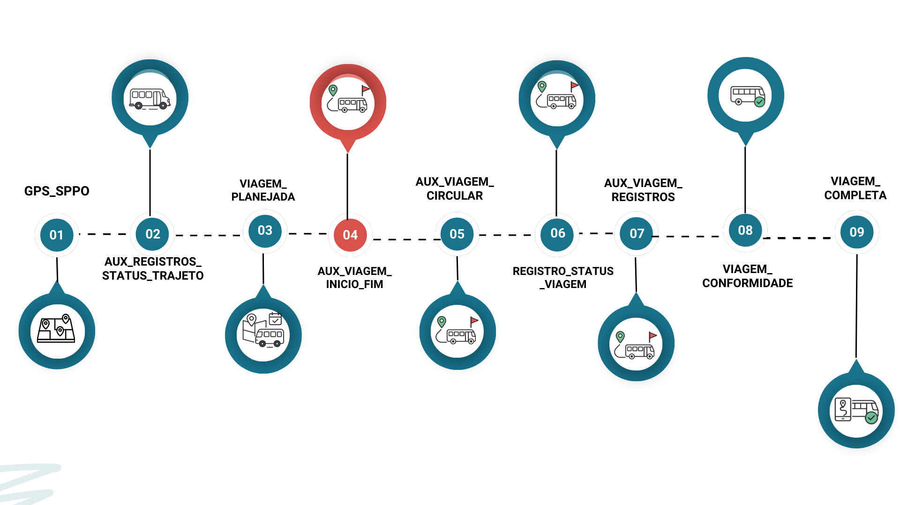

### Documentação consolidada do processo de apuração das viagens para o subsídio do transporte público municipal do Rio de Janeiro. 
*Inclui glossário, descrição dos modelos que são apresentados na sequência de execução da pipeline.*

------------------------------------------------------------------------------
------------------------------------------------------------------------------
## **Glossário:**
- **Distância aferida**: Cálculo da distância percorrida entre dois pontos de dados de GPS sucessivos;
- **Garagem**: Local onde os veículos de transporte ficam quando não estão em operação;
- **GTFS**: Arquivo contendo informações sobre linhas de ônibus e serviços de BRT da cidade do Rio de Janeiro. Atualizado mensalmente pela Secretaria Municipal de Transportes <https://www.data.rio/datasets/8ffe62ad3b2f42e49814bf941654ea6c/about>;
- **id_veiculo**: Identificação do veículo a partir de um número de ordem;
- **id_viagem**: Identificação única para cada viagem;
- **Modelo ephemeral e incremental**: Vide DBT (<https://docs.getdbt.com/docs/build/materializations>);
- **Plano operacional**: Documento divulgado pelo site <https://transportes.prefeitura.rio> que contém as características operacionais dos serviços;
- **Ponto**: Comunicação pontual do GPS;
- **Rota planejada**: Rota planejada para aquele tipo de serviço e sentido conforme o GTFS;
- **Rota realizada**: Rota realizada pelo veículo em determinado tipo de serviço, sentido, data, horário;
- **Serviço**: Codificação alfanumérica que possui itinerário pré-definido e especificação de quilometragem;
- **Shape** - Elemento geométrico que representa o espaço em formato linestring ou multilinestring;
- **Timestamp** - Registro de data e hora;
- **Viagem** - O percurso completo de um veículo, partindo de um ponto inicial e terminando em um ponto final, com determinado horário de início e término[duas meias viagens];
- **Viagem Circular** - Viagens que o início e o fim do trajeto possuem a mesma geolocalização. 

------------------------------------------------------------------------------
## ETAPA 1
- A Figura 1 apresenta um esquema do processo, no qual cada etapa será detalhada nas seções seguintes.
- 

## **1. GTFS** 

- Esta etapa antecede a preparação da tabela de dados de GPS, que será utilizada na apuração das viagens.
- Consiste no tratamento e estruturação dos dados do GTFS para que possam ser corretamente consumidos nas etapas subsequentes.
- São utilizados os modelos sppo_realocacao, sppo_registros, sppo_aux_registros_filtrada, sppo_registros_relocacao, sppo_aux_registros_relocacao, sppo_aux_registros_flag_trajeto_correto, sppo_aux_registros_parada, sppo_aux_registros_velocidade que serão detalhados a seguir.

    **1.1 sppo_realocacao**
    - Caminho do modelo: prefeitura_rio/pipelines_rj_smtr/queries/models/br_rj_riodejaneiro_onibus_gps/sppo_realocacao.sql
         
         * **1.1.1 Objetivo**: Padronização de dados
         
         * **1.1.2 Fluxo de execução do modelo**:
          * *Consulta* que converte o id_veiculo para string, ajusta o timestamp para o horário de São Paulo, transforma a coluna serviço gerando um identificador padronizado.
         
         * **1.1.3 Resultados apresentados**
         * Trata os dados para o modelo sppo_aux_registros_relocacao

    **1.2 sppo_aux_registros_relocacao**
    - Caminho do modelo:   prefeitura_rio/pipelines_rj_smtr/queries/models/br_rj_riodejaneiro_onibus_gps/sppo_aux_registros_realocacao.sql
         
         * **1.2.1 Objetivo**: O modelo ajusta os registros de GPS com o serviço, garantindo que nenhum veículo tenha mais de um serviço alocado para aquela viagem.
           
         * **1.2.2 Fluxo de execução do modelo**:
          * *Materização*: Caso a variável 15 estiver ativa, trata-se de um modelo ephemeral, caso contrário é incremental.
          * *Filtra* os registros de gps.
          * *Combina o gps* com a realocação. 
         
         * **1.2.3 Resultados apresentados**
         * Trata os dados para o modelo sppo_aux_registros_filtrada.

    **1.3 sppo_registros**
    - Caminho do modelo: prefeitura_rio/pipelines_rj_smtr/queries/models/br_rj_riodejaneiro_onibus_gps/sppo_aux_registros_filtrada.sql
         
         * **1.3.1 Objetivo**: Filtragem e tratamentos básicos de registro de gps.
         
         * **1.3.2 Fluxo de execução do modelo**:
          * *Filtra* que converte a coluna ordem para string.
          * *Trata* a latitude e longitude.
         
         * **1.3.3 Resultados apresentados**
         * Trata os dados para o modelo sppo_aux_registros_filtrada.
     
    **1.4 sppo_aux_registros_filtrada**
    - Caminho do modelo: prefeitura_rio/pipelines_rj_smtr/queries/models/br_rj_riodejaneiro_onibus_gps/sppo_aux_registros_filtrada.sql
         
         * **1.4.1 Objetivo**: Filtragem e tratamento básico de registros de gps.
         
         * **1.4.2 Fluxo de execução do modelo**:
           * *Materização*: Caso a variável 15 estiver ativa, trata-se de um modelo ephemeral, caso contrário é incremental.
           * *Filtra* registros que estão fora de uma marcação geográfica que contém a área do município de Rio de Janeiro. Usando a função st_intersectsbox [Vide documentação <https://postgis.net/docs/ST_Intersects.html>]
           * *Filtra* registros antigos. Remove registros que tem diferença maior que 1 minuto entre o timestamp_captura e timestamp_gps.
           * *Renomeia* ordem para id_veiculo.
                  
         * **1.4.3 Resultados apresentados**
         * Trata os dados para os modelos sppo_aux_registros_flag_trajeto_correto, sppo_aux_registros_parada, sppo_aux_registros_velocidade.

    **1.5 sppo_aux_registros_velocidade**
    - Caminho do modelo: prefeitura_rio/pipelines_rj_smtr/queries/models/br_rj_riodejaneiro_onibus_gps/sppo_aux_registros_velocidade.sql
         
         * **1.5.1 Objetivo**: Filtragem e tratamento básico de registros de gps.
         
         * **1.5.2 Fluxo de execução do modelo**:
           * *Materização*: Ephemeral.
           * *Calcula* a distância em metros entre a posição atual do veículo e aposição anterior. Usa a função lag [Vide documentação<https://www.postgresql.org/docs/current/functions-window.html>]
           * *Calcula* a velocidade instântanea.
           * *Cria* um indicador boleano para verificar se o veículo está em movimento.
                               
         * **1.5.3 Resultados apresentados**
         * Fornece insumos diretos para a Tabela gps_sppo.

    **1.6 sppo_aux_registros_parada**
    - Caminho do modelo: prefeitura_rio/pipelines_rj_smtr/queries/models/br_rj_riodejaneiro_onibus_gps/sppo_aux_registros_parada.sql
         
         * **1.6.1 Objetivo**: Identifica veículos parados em terminais ou garagens.
         
         * **1.6.2 Fluxo de execução do modelo**:
           * *Materização*: Ephemeral.
           * *Seleciona* a lista de terminais e garagens conhecidos para a definição do tipo_parada igual a terminal. Utiliza a função ST_GEOGPOINT e ST_GEOGFROMTEXT [vide documentação <https://cloud.google.com/bigquery/docs/reference/standard-sql/geography_functions>]
           * *Calcula* a velocidade instântanea.
           * *Cria* um indicador boleano para verificar se o veículo está em movimento.
                               
         * **1.6.3 Resultados apresentados**
         * Fornece insumos diretos para a Tabela gps_sppo.
     
      **1.7 sppo_aux_registros_flag_trajeto_correto**
    - Caminho do modelo: prefeitura_rio/pipelines_rj_smtr/queries/models/br_rj_riodejaneiro_onibus_gps/sppo_aux_registros_flag_trajeto_correto.sql
         
         * **1.7.1 Objetivo**: Identifica se os veículos estão dentro de um trajeto planejado.
         
         * **1.7.2 Fluxo de execução do modelo**:
           * *Materização*: Ephemeral.
           * *Verifica* a partir de uma janela de tempo (período pré-estabelecido) se o veículo esteve pelo menos uma vez dentro do trajeto planejado. 
           * *O Serviço* é verificado, analisa se ele está no cadastro do SIGMOB.
           * *Utiliza* a função ST_DWITHIN [vide documentação<http://postgis.net/docs/ST_DWithin.html>] com um buffer de 500 metros para verificar se o ponto está próximo do shape. Se ele esteve pelo menos uma vez no trajeto correto, cria uma flag_trajeto_correto_hist com o valor TRUE, caso contrário, essa flag recebe o valor FALSE.
                               
         * **1.7.3 Resultados apresentados**
         * Fornece insumos diretos para a Tabela gps_sppo.   

- ## LINHAGEM DOS MODELOS
- 

------------------------------------------------------------------------------
## ETAPA 2
- 

## **2. Tabela: gps_sppo** 
- Caminho do modelo: prefeitura_rio/pipelines_rj_smtr/queries/models/br_rj_riodejaneiro_veiculos/gps_sppo.sql
- Modelo Incremental particionado por data com granularidade diária.

* **2.1 Objetivo**: A tabela *gps_sppo* armazena os dados do gps após passar pelas transformações de cálculo da velocidade instantânea, cálculo da velocidade média, análise se o veículo encontra-se parado, conformidade com a rota.

* **2.2 Fluxo de execução do modelo**:
 - *CTE[registros]*: seleciona os registros do gps por um filtro de data.
      - Utiliza a tabela ephemeral *sppo_aux_registros_filtrada* e seleciona os campos id_veiculo, timestamp_gps, timestamp_caputura, velocidade, linha, latitude e longitude.
    
 - *CTE[velocidades]*: seleciona as informações de velocidade, distância e movimento.
   - Utiliza a tabela ephemeral *sppo_aux_registros_velocidade* e seleciona os campos id_veiculo, timestamp_gps, velocidade, linha, distancia, flag_em_movimento.
   
 - *CTE[paradas]*: seleciona os tipos parada dos veiculos, como terminal, garagem.
   - Utiliza a tabela ephemeral *sppo_aux_registros_parada* e seleciona os campos id_veiculo, timestamp_gps, linha, tipo de parada.

 - *CTE[flags]*: seleciona as flags (indicadores) que determinam de forma booleana (True ou False) se o veículo está dentro do trajeto correto, além de verificar se a linha existe no sigmob.
   - Utiliza a tabela ephemeral *sppo_aux_registros_flag_trajeto_correto* e seleciona os campos id_veiculo, timestamp_gps, linha, route_id, flag_linha_existe_sigmob, flag_trajeto_correto, flag_trajeto_correto_hist .
  
- *Junção final*: seleciona as informações das CTE´s classifica se o veículo está em operação, operando fora do trajeto e define o tipo de parada, como parado trajeto correto e parado fora do trajeto.

* **2.3 Resultados apresentados**
- *Cálculo da velocidade instantânea [velocidade_instantanea]*
  - A velocidade instantânea é calculada dividindo a distância percorrida pelo tempo entre dois registros de timestamp consecutivos. 
  - O resultado é então multiplicado por 3,6 para converter a unidade para km/h.

- *Cálculo da velocidade média [velocidade_estimada_10_min]*
  - Modelo ephemeral [sppo_aux_registros_velocidade.sql]
  - A velocidade média é zerada quando há qualquer alteração de veículo ou serviço.
  - A velocidade média é calculada a partir da média das velocidades dos últimos 10 minutos (declarado no modelo como 600 seconds).
  - Antes de completar os 10 minutos, a velocidade média permanece igual a zero.
  - Caso a velocidade exceda 60 km/h (sendo um outlier), ela será ajustada para 60 km/h.

- *Veículo parado [tipo_parada]*
  - Modelo ephemeral [sppo_aux_registros_parada]
  - Veículo recebe o *status quo* de parado quando a velocidade entre dois pontos é igual a 0km/h.
  - Velocidade limiar parada: 3km/h
  - O veículo poderá estar parado próximos a terminais (dentro de um raio de 250m) ou dentro da garagem.
  Esta definição permite rotular as observações da coluna tipo_parada como "Em operação", "Parado garagem"

 * **2.4 Linhagem**:
- 

* **2.5 Modelo da Tabela**:
- 

------------------------------------------------------------------------------
## ETAPA 3
- 

## **3. Aux_registros_status_trajeto**
 - Caminho do modelo: prefeitura_rio/pipelines_rj_smtr/queries/models/projeto_subsidio_sppo/aux_registros_status_trajeto.sql
         
**3.1 Objetivo**: Monitorar e classificar a posição dos veículos de transporte público em relação às suas rotas planejadas
         
**3.2 Fluxo de execução do modelo**:
           * *Materização*: Não declarada.
           * *Busca o GTFS* vigente.
           * *Filtra* registros da Tabela gps_sppo com o critério d-2
           * *Remove* os veículos parados em garagem.
           * *Correspondência do tipo de serviço*, o modelo analisa que se o serviço informado via GPS está igual ao serviço planejado. 
           * *Utiliza a função ST_GEOPOINT* para criar um ponto georreferenciado. [vide documentação <https://cloud.google.com/bigquery/docs/reference/standard-sql/geography_functions>].
           * *Utiliza a função ST_DWINTHIN* para verificar se a posição do veículo está dentro do planejado.
           * *Gera um buffer* {{ var("buffer") }} define o quanto o veículo precisa estar próximo a rota para que o trajeto seja considerado válido ( Atualmente o buffer está declarado como 500 metros)
           * *Classifica* o status viagem em start, middle e end. Sendo que start.
                  *Indicador de posição:*
                  * start: o veículo está próximo ao início da rota.
                  * middle: a viagem e o veículo recebem o status de middle a partir da primeira comunicação depois do buffer inicial (start).
                  * end: o veículo encontra-se próximo ao final da rota
                  * out: veículo fora da rota.
           * *Modelo* esquemático:
- 

                  
**3.3 Resultados apresentados**
         * Oferecer insumos para as tabelas registro_status_viagem, aux_viagem_inicio_fim. Classificar as viagens conforme o posicionamento. 

**3.4 Linhagem**:
- 

* **3.5 Modelo da Tabela**:
- 

------------------------------------------------------------------------------
## ETAPA 4
- 

## **4. Viagem Planejada**
 - Caminho do modelo:  prefeitura_rio/pipelines_rj_smtr/queries/models/projeto_subsidio_sppo/viagem_planejada.sql
         
**4.1 Objetivo**: Criar uma tabela unificada de viagens planejadas .
         
**4.2 Fluxo de execução do modelo**:
           * *Materização*: Incremental.
         
**4.3 Resultados apresentados**
         * Tabela unificada com os dados de viagens planejadas.

**4.4 Linhagem**:
- 

**4.5 Modelo da Tabela**:
- 

------------------------------------------------------------------------------
## **5. Aux_viagem_inicio_fim**
 - Caminho do modelo: prefeitura_rio/pipelines_rj_smtr/queries/models/projeto_subsidio_sppo/aux_viagem_inicio_fim.sql
         
**5.1 Objetivo**: Elabora um parâmetro das viagens completas (partida e chegada) de cada veículo no shape planejado.
         
**5.2 Fluxo de execução do modelo**:
           * *Materização*: Não declarada.
           * *Analisa* se há diferença entre duas classificações de registro de GPS, próximo registro do GPS for middle, então o anterior é o início da viagem, se mudar o status de middle, então tem-se o fim da viagem. 
           * *startend* um padrão para detectar se a viagem é curta
           * *Função lead* cada registro de partida é pareado com o seu próximo registro de chegada na mesma linha, guardando também suas posições geográficas. [Vide documentação para função Lead <https://learn.microsoft.com/pt-br/sql/t-sql/functions/lead-transact-sql?view=sql-server-ver16>]
           * *Cria um id único* para a viagem.
           * *Calcula* a distância entre o planejado e o real usando a função st_distance ao selecionar o ponto inicial e o ponto final. [Vide documentação <https://learn.microsoft.com/pt-br/stream-analytics-query/st-distance>] Além disso, faz uma divisão por mil para transformar metros em quilometros e arredonda para três casas decimais.
      
**5.3 Resultados apresentados**
         * Transforma a sequência de pontos do GPS em uma viagem com data e hora, posição inicial e final, distância real e planejada e cria um id único com o objetivo de fornecer insumos para a Tabela Viagem em conformidade.

**5.4 Linhagem**:
- 

------------------------------------------------------------------------------
## **6. Tabela: registros_status_viagem**
 - Caminho do modelo: prefeitura_rio/pipelines_rj_smtr/queries/models/projeto_subsidio_sppo/registro_status_viagem.sql
         
**6.1 Objetivo**: Filtrar os registros de GPS e selecionar apenas aqueles que fazem parte de viagens realizadas que tenha um  início e um fim.
         
**6.2 Fluxo de execução do modelo**:
           * *Materização*: Incremental com granularidade diária.
           * *Id_veiculo + horário e data(timestamp)* são a chave 
           * *Unifica* a tabela inicio e fim com a aux_circular (item 7)
       
**6.3 Resultados apresentados**
         * Transforma os registros de GPS em uma base com os registros de viagem realmente realzadas.

**6.4 Linhagem**:
- 

**6.5 Modelo da Tabela**:
- 

------------------------------------------------------------------------------
## **7. Aux_viagem_circular**
 - Caminho do modelo: prefeitura_rio/pipelines_rj_smtr/queries/models/projeto_subsidio_sppo/aux_viagem_circular.sql
         
**7.1 Objetivo**: Identificar as viagens circulares de ida e volta.
         
**7.2 Fluxo de execução do modelo**:
           * *Materização*: Não declarada.
           * *Usa a função lead* para encontrar as viagens de ida que são imediatamente seguidas por uma de volta quando há um mesmo serviço e veículo. [Vide documentação para função Lead <https://learn.microsoft.com/pt-br/sql/t-sql/functions/lead-transact-sql?view=sql-server-ver16>]
           * *Reatribui um novo id_viagem* para ida e para volta.
           * *Junta* todas as viagens.
       
**7.3 Resultados apresentados**
         * Gera uma tabela consolidada com as viagens circulares de ida e volta que possuem um mesmo id_viagem e combina com as demais viagens que não são circulares.

**7.4 Linhagem**:
- 

------------------------------------------------------------------------------
## **8. Aux_viagem_registros**
 - Caminho do modelo: prefeitura_rio/pipelines_rj_smtr/queries/models/projeto_subsidio_sppo/aux_viagem_registros.sql
         
**8.1 Objetivo**: Consolidar a quilomentragem das viagens.
         
**8.2 Fluxo de execução do modelo**:
           * *Materização*: Não declarada.
           * *CTE distancia* para calcular a distancia percorrida, somando todas as distancias de todos os trechos e converte em quilometro. Em max(distancia_inicio_fim) inclui um gap, considerando o primeiro sinal de gps e o ponto inicial do shape e o último sinal do gps como o ponto final e arredonda para três casas.
           * *Conta o registro* das comunicações criando a instância n_registros_total e cria também a n_registros_minuto para não contar dois registros que foram emitidos no mesmo minuto.
           * *CTE filtro de datas* que verifica um ou dois dias de dados. Essa parte do modelo faz essa análise dos dias:
            - data = date_sub(date("{{ var("run_date") }}"), interval 1 day)
            - 
             - data between date_sub(date("{{ var("run_date") }}"), interval 1 day) and date("{{ var("run_date") }}")
             - 
            * *CTE consolidação final* agrupa pelo id_viagem e consolida os cálculos de distância e refistros de gps. 
       
**8.3 Resultados apresentados**
         * Elabora indicadores por viagem com a distância aferida, pontos de gps por fase (start, middle, end e out) e quantos minutos tiveram registros de gps.

**8.4 Linhagem**:
- 

