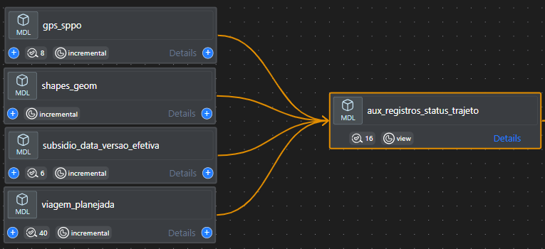
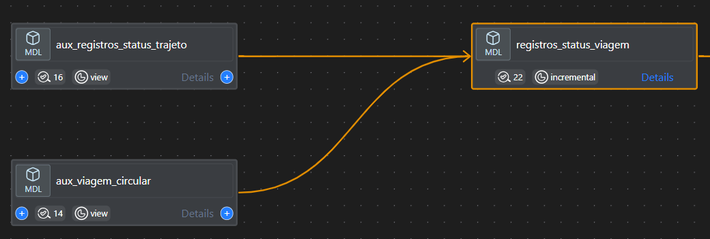

## **1. Fonte de dados: gps_sppo**

Este é o ponto de partida, contendo dados brutos de GPS de ônibus.
<p\>

- **Cálculo de velocidade e movimento:**
  - Usando a função ST_DISTANCE, o sistema calcula a distância entre dois pontos consecutivos de GPS.

  - A velocidade é calculada dividindo a distância pelo intervalo de tempo entre os pontos.

  - A velocidade é convertida para km/h para padronizar as análises.

  - Além disso, uma média móvel é aplicada nas velocidades dos últimos 10 minutos para suavizar flutuações naturais no GPS.

- **Identificação de paradas:**
  - O sistema verifica se os veículos estão parados próximos a terminais (dentro de um raio de 250 metros) ou se estão dentro de uma garagem. Essas informações são úteis para identificar quando um ônibus está operando ou parado em um local previsto (terminal/garagem).
  - Embora estejam em desuso, as flags utilizadas para identificar o tipo de parada ainda são utilizadas no SIGMOB.

Essa etapa fornece dados fundamentais que serão processados nas etapas seguintes, ajudando a categorizar o status operacional de cada ônibus.

## **2. Processamento de registros e status de viagens: aux_registros_status_trajeto**

Após o processamento inicial dos dados de GPS, os registros são armazenados na tabela **aux_registros_status_trajeto**. Esse processo é estruturado em duas partes principais: processamento dos dados de **GPS** e análise do **status_viagem**.

- **Processamento de GPS:**
  - Utiliza a tabela **gps_sppo** como fonte principal.
  - Seleciona todos os campos dessa tabela, exceto **longitude**, **latitude** e **serviço**.
  - Adiciona colunas extras, como:
    - **id_empresa**: Obtido a partir de uma substring de **id_veiculo**.
    - **posicao_veiculo_geo**: Cria um ponto geográfico a partir dos dados de longitude e latitude usando a função **ST_GEOGPOINT**.
  - Aplica filtros para processar apenas os dados dentro de uma janela de tempo específica (Entre D-2 às 00h até D-1 às 3h) e remove registros com o status "Parado na garagem".

- **Análise do status da viagem:**
  - Realiza um **JOIN** com a tabela **viagem_planejada**, que contém as informações das rotas planejadas para comparação.
  - A coluna **distancia** é tratada para receber um valor padrão de 0, caso os valores estejam nulos.
  - Define o **status_viagem** como "start", "end", "middle" ou "out", com base na proximidade do veículo a determinados pontos da rota, utilizando a função **ST_DWITHIN**.

Essa etapa é essencial para associar os dados reais de GPS aos planejamentos de rota e viagem, permitindo o monitoramento da conformidade e do status operacional de cada viagem.

## **3. Identificação do início e fim das viagens: aux_viagem_inicio_fim**

Esta etapa busca identificar com precisão os momentos de início e fim das viagens de cada veículo.

- **Identificação de status de viagem (aux_status):**
  - Analisa a sequência de status dos registros de GPS para identificar o início e o fim das viagens.
  - Define uma coluna chamada **middle** como verdadeira quando o status de viagem muda de "start" para "midle".
  - Da mesma forma, define a coluna **ends** como verdadeira quando o status muda de "middle" para "end".

- **Geração de informações de início e fim (aux_inicio_fim):**
  - A partir dos status identificados, gera as colunas **datetime_partida** (indicando a hora de início da viagem) e **datetime_chegada** (hora de chegada) com base nos registros de início e fim extraídos de **aux_status**.
  - Aplica um filtro para incluir apenas os registros onde as colunas **starts** ou **ends** são verdadeiras, garantindo que sejam consideradas apenas viagens com início e fim claramente definidos.

- **Ajuste dos registros de viagem (inicio_fim):**
  - Os dados são ordenados por veículo e rota. Utiliza-se a função **LEAD** para capturar a próxima **datetime_chegada** (hora de chegada), de modo a identificar a chegada prevista para o próximo ponto.
  - Exclui os registros de chegada intermediários para manter apenas o momento de chegada mais recente.

Esta etapa permite que o sistema gere um **id_viagem** único e calcule a distância entre o ponto de partida e o ponto de chegada de cada viagem.

### **4. Registro dos status de viagem: registro_status_viagem**

Depois de identificar os registros de início e fim das viagens, os dados são combinados com a tabela **aux_viagem_circular** para identificar o comportamento circular das viagens (ida e volta).

- A tabela **registros_status_viagem** realiza um **JOIN** entre **aux_registros_status_trajeto** e **aux_viagem_circular**, cruzando os registros de veículos e trip_id.
- Só são selecionados os registros com um **id_viagem** válido e que correspondam ao período entre **datetime_partida** e **datetime_chegada**.

## **5. Identificação de viagens circulares: aux_viagem_circular**

Esta etapa identifica e trata viagens circulares, ou seja, aquelas em que ida e volta ocorrem de forma consecutiva como parte de uma mesma operação.

- **Identificação de Ida e Volta (ida_volta_circular):**
  - Utiliza a função **LEAD** para verificar se o próximo trecho de uma viagem corresponde a um trecho de volta (marcado como sentido 'V').
  - Armazena as informações de horários de partida e chegada desses trechos de volta para garantir que as viagens circulares sejam identificadas e tratadas corretamente.

- **Processamento de Viagem Circular (viagem_circular):**
  - Combina os dados gerados anteriormente, atribuindo um **id_viagem** único às viagens identificadas como circulares, abrangendo tanto a ida quanto a volta.
  - Filtra registros onde o **id_viagem** seja nulo, assegurando que apenas as viagens circulares válidas e completas sejam incluídas no processamento final.

- **Combinação de Registros (UNION ALL):**
  - Após identificar e tratar as viagens circulares, o sistema combina esses registros com outros tipos de viagens que não são circulares, mas que também são relevantes para o processo. Isso assegura que todas as viagens úteis, sejam circulares ou não, estejam disponíveis para análises subsequentes.

## **6. Conformidade de Viagens: viagem_conformidade**

A tabela **viagem_conformidade** é responsável por validar se as viagens realizadas de fato cumpriram o que foi planejado. Essa verificação é feita a partir da análise de correspondência entre as viagens executadas e as planejadas no GTFS, levando em consideração parâmetros de tempo, rota e data.

- **Análise de Conformidade Operacional:**
  - Compara os dados das viagens realizadas com as viagens planejadas com base nos seguintes critérios:
    - **Linha**, **sentido**, **data**, **shape_id**, **viagem_id**, **hora_saida**.
    - Verifica a **janela de tolerância de horário** para validar se a viagem pode ser considerada correspondente.
  - As viagens são classificadas em:
    - **Conforme**: compatível com o planejamento.
    - **Não conforme**: fora do intervalo de tolerância.
    - **Exceção**: casos justificados, como desvios previamente autorizados.
  - Cada correspondência leva em conta as condições do dia, que vêm da tabela `subsidio_data_versao_efetiva`.

- **Integração com o Planejamento:**
  - Realiza **JOIN** com a tabela `viagem_planejada`, que contém todas as viagens do GTFS válidas para aquele dia.
  - O cruzamento garante que somente as viagens previstas na versão correta do planejamento sejam consideradas na validação.

Essa tabela é essencial para garantir a transparência e justiça nos cálculos de conformidade e pagamento de subsídio, pois filtra apenas o que foi realizado de acordo com as regras operacionais previstas.

## **7. Planejamento de Viagens: viagem_planejada**

Nesta etapa, os dados de viagem planejada são construídos a partir de versões consolidadas do GTFS, considerando:

- Informações provenientes de `subsidio_data_versao_efetiva`, que define os parâmetros de versão (como `tipo_dia`, `subtipo_dia`, `feed_version`, `feed_start_date`, `tipo_os`) utilizados na junção com os dados operacionais;
- O conjunto `ordem_servico_trips_shapes_gtfs`, que fornece as combinações entre trips e shapes planejadas para diferentes serviços;
- A combinação dos dados do dia atual com o dia anterior, permitindo identificar e consolidar as viagens planejadas dentro de uma faixa horária definida;
- Regras específicas são aplicadas para tratar situações particulares de mapeamento entre serviços (como substituições de códigos);
- As faixas horárias (`inicio_periodo`, `fim_periodo`, `faixa_horaria_inicio`, `faixa_horaria_fim`) são convertidas para `datetime`, garantindo alinhamento temporal com a `data` de referência;
- A forma geométrica dos percursos é obtida a partir do `shapes_geom_gtfs`, com priorização da versão mais recente por `shape_id`.

O resultado final consolida as viagens planejadas por serviço, sentido, shape e `trip_id`, contendo dados como:

- Total de partidas planejadas (`partidas_total_planejada`);
- Distância estimada (`distancia_planejada` e `distancia_total_planejada`);
- Intervalos de operação;
- Identificadores de trajeto (`trip_id_planejado`, `shape_id_planejado`);
- Metadados como `feed_version`, `feed_start_date`, `sentido_shape` e `id_tipo_trajeto`.

A agregação é feita para garantir unicidade e consistência dos registros finais utilizados na construção da base de subsídio.

## **8. Identificação de Viagens Completas: viagem_completa**

A tabela **viagem_completa** representa a etapa final na avaliação das viagens realizadas, sendo responsável por identificar aquelas que ocorreram de forma **completa**, com qualidade mínima aceitável de dados e alinhamento ao planejamento operacional.

Esse processo envolve a integração entre a **viagem_conformidade**, que contém as características e métricas das viagens realizadas, e a **viagem_planejada**, que traz os parâmetros previstos no planejamento GTFS, como horários, shape, serviço e períodos de operação. A associação entre elas é feita com base no `trip_id`, `data`, `serviço` e `vista`, permitindo avaliar cada viagem realizada frente ao que estava previsto.

- **Composição Inicial:**
  - Une os dados das viagens realizadas (**viagem_conformidade**) às viagens esperadas no planejamento (**viagem_planejada**), restringindo a análise apenas às viagens esperadas para aquele dia e período.
  - A versão de planejamento usada é obtida da tabela **subsidio_data_versao_efetiva**, garantindo que cada data utilize o conjunto correto de shapes (trajetos).

- **Critérios de Viagem Completa:**
  - A viagem deve atingir os seguintes mínimos:
    - **percentual de conformidade de shape** (trajeto seguido pelo veículo).
    - **conformidade de distância percorrida**, comparando o realizado com o previsto.
    - **número mínimo de registros de GPS**.
  - Em casos específicos (como trechos curtos ou baixa velocidade), regras alternativas são aplicadas, permitindo classificar viagens como completas mesmo com variações.

- **Classificação da Viagem:**
  - Quando o `servico_realizado` é igual ao `servico_informado`, a viagem é marcada como **"Completa linha correta"**.
  - Se houver divergência entre o serviço executado e o planejado, é classificada como **"Completa linha incorreta"**.

- **Tratamentos Especiais:**
  - Algumas datas possuem regras específicas, como feriados (ex: Ano Novo) ou eventos atípicos (ex: shows de grande porte).
  - Nestes casos, são aplicadas tolerâncias de horário adicionais e filtros adaptados para garantir uma análise justa da operação.

- **Filtros de Qualidade Final:**
  - Em situações onde há múltiplas viagens com a mesma hora de partida e chegada, aplica-se um critério de desempate:
    - Prioriza a viagem com **maior percentual de conformidade de shape**.
    - Em seguida, a que possui **maior distância planejada**.
  - Isso garante que apenas a viagem mais representativa e completa seja selecionada.

Essa tabela é essencial para a análise de desempenho operacional e para o cálculo de indicadores de qualidade e subsídio. Ao focar nas viagens completas com maior alinhamento ao planejado, ela fornece uma base sólida e confiável para auditorias, remuneração e ajustes na malha de transporte.
