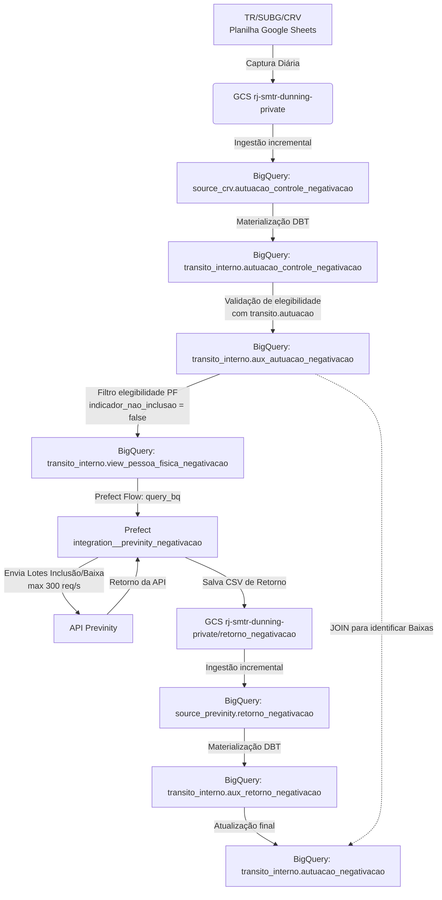

# FRAME-DADOS – Framework de Documentação de Projetos de Dados Públicos

## 1. Identificação do Projeto

* **Nome do Projeto:** Integração automatizada para inclusão de multas de trânsito em cadastro de inadimplentes via birô de crédito
* **Identificador do Projeto:** `previnity_negativacao`
* **Equipe Técnica:**
    * Rodrigo Cunha (Diretor Técnico Especial de Dados e Inovação)
    * Guilherme Botelho (Engenheiro de Dados)
* **Instituição/Setor:** PCRJ/SMTR/SUBTT
* **Data de Início:** 19/11/2025
* **Status:** Concluído

## 2. Objetivo e Justificativa

  A SMTR realiza a negativação extrajudicial de multas de trânsito vencidas para fins de cobrança, além da baixa dos registros que já foram quitados ou suspensos. Anteriormente, esse processo dependia de extrações e uploads manuais em planilhas, o que não era escalável e aumentava os riscos de inconsistência nos registros e de negativações indevidas.

  O objetivo deste projeto é automatizar a integração entre o data lakehouse da SMTR (GCP/BigQuery) e o birô de crédito (Previnity), garantindo a captura diária de indicações de negativação, validação prévia de elegibilidade das multas (verificando pagamento, recursos ou defesas em curso) e o envio dos lotes de inclusão e exclusão de negativações de forma automatizada por API.

## 3. Diagnóstico e Fontes de Dados

* **Bases utilizadas:**
  * Planilha Google Sheets contendo a indicação de negativação das autuações.
  * Autuações lavradas pelos agentes de trânsito da PCRJ e órgãos conveniados (`rj-smtr.transito.autuacao`).
* **Origem dos dados:**
  * **TR/SUBG/CRV**, responsáveis pela indicação de multas para inclusão.
  * **RADAR/SERPRO**, provedor da base de autuações.
* **Avaliação da qualidade e limitações:**
  * **Qualidade da Origem:** Dependência do preenchimento correto da planilha pela área operacional.
  * **Restrições da API:** Limitação a 300 requisições simultâneas por segundo imposta pela API da Previnity.

## 4. Regras de Negócio

### 4.1 Critérios de Elegibilidade para Negativação

As multas consideradas elegíveis devem atender **cumulativamente** aos critérios abaixo, verificados de forma automatizada pela pipeline (conforme TED_002-25_DTDI/SUBTT-SUBG/CRV):

| Critério | Regra |
|---|---|
| **Situação da infração** | `status_infracao = 'NP Gerada'` e `descricao_situacao_autuacao IN ('Ativo', 'Desvinculado')` |
| **Pagamento** | Sem registro de pagamento total ou parcial (`data_pagamento IS NULL`) |
| **Responsável identificado** | Proprietário ou possuidor do veículo identificado nos registros cadastrais (`documento_proprietario` ou `documento_possuidor_veiculo` não nulo) |
| **Recurso administrativo** | Sem recurso à penalidade em andamento (`recurso_penalidade_multa IS NULL`) |
| **Defesa administrativa** | Sem processo de defesa em tramitação (`processo_defesa_autuacao IS NULL`) |
| **Indicação pela CRV** | `id_auto_infracao` presente na tabela `autuacao_controle_negativacao` |

O CPF/CNPJ negativado é o do proprietário ou possuidor do veículo (conforme art. 282, § 3° do CTB). O endereço utilizado é o registrado no RENAVAM.

### 4.2 Critérios de Baixa

A baixa é registrada automaticamente no próximo dia útil após detecção de:

* Pagamento da multa (`data_pagamento IS NOT NULL`), ou
* Cancelamento ou suspensão da autuação.

A pipeline identifica esses casos via `JOIN` com `transito.autuacao` e envia a baixa à Previnity via API, gravando a confirmação em `autuacao_negativacao`.

## 5. Levantamento de Requisitos

### Requisitos Funcionais

| Código | Requisito |
|---|---|
| **RF01.1** | TR/SUBG/CRV preenche planilha Google Sheets com `data_autuacao` e `id_auto_infracao` das autuações indicadas para negativação. |
| **RF01.2** | Pipeline de captura automática e diária da planilha Google Sheets, armazenando arquivo no GCS (`rj-smtr-dunning-private`). |
| **RF01.3** | Materialização incremental na tabela `transito_interno.autuacao_controle_negativacao`. |
| **RF02.1** | Views estruturadas conforme modelo de dados da Previnity, respeitando campos obrigatórios e opcionais por tipo de pessoa (PF/PJ). |
| **RF02.2** | Campos sensíveis (CPF, nome, endereço) protegidos com Policy Tags e controle de acesso via IAM (GCP). |
| **RF02.3** | Criação das tabelas: `autuacao_controle_negativacao`, `aux_autuacao_negativacao` e `autuacao_negativacao` no dataset `transito_interno`. |
| **RF02.4** | Criação das views `view_pessoa_fisica_negativacao` e `view_pessoa_juridica_negativacao`. |
| **RF03.1** | Pipeline de integração que consulta as views e realiza inclusão e baixa via API da Previnity. |
| **RF03.2** | Validação prévia de elegibilidade antes do envio, registrando `indicador_nao_inclusao` e `motivo_nao_inclusao` quando bloqueado. |
| **RF03.3** | Registro das confirmações da API: `data_confirmacao_inclusao` e `indicador_inclusao` para inclusões; `data_confirmacao_baixa` e `indicador_baixa` para baixas. |
| **RF04.1** | Baixa identificada automaticamente na materialização ao detectar pagamento, cancelamento ou prescrição (via JOIN com `transito.autuacao`). |
| **RF04.2** | Envio da baixa via API da Previnity com registro de confirmação em `autuacao_negativacao`. |
| **RF05.1** | Reprocessamento de registros rejeitados com rastreabilidade do motivo da falha. |
| **RF05.2** | Teste de consistência periódico (`test_consistencia_autuacoes_negativadas_pagas_sem_baixa`) validando que todas as multas pagas foram devidamente baixadas. |
| **RF06.1** | Reprocessamento manual ou automático de registros rejeitados sem perda de dados. |
| **RF06.2** | Notificações automáticas em caso de falhas na ingestão ou rejeição de registros (alertas via Discord/Sentry). |

### Requisitos Não Funcionais

| Código | Requisito |
|---|---|
| **RNF01.1** | Acesso às views restrito via autenticação IAM, com controle por projeto e serviço. |
| **RNF01.2** | Campos sensíveis (CPF, nome, endereço) com Policy Tags. |
| **RNF02** | Conformidade com LGPD (Lei nº 13.709/2018) e Decreto Rio nº 54.984/2024, com base legal em execução de política pública. |
| **RNF03.1** | Tabelas e views disponíveis 24×7. |
| **RNF03.2** | Atualização diária automatizada com agendamento e registro de execução. |
| **RNF04** | Tabelas e views otimizadas com particionamento incremental por `data` (data da autuação). |
| **RNF05.1** | Todo acesso às views auditável via Audit Logs do GCP. |
| **RNF05.2** | Alterações estruturais nas views documentadas com controle de versão e histórico auditável. |
| **RNF06.1** | Formato de dados conforme padrões técnicos e ontológicos definidos pela SMTR/PCRJ e GCP/BigQuery. |
| **RNF06.2** | Integração via API seguindo padrões de autenticação e formato definidos na documentação técnica da Previnity. |
| **RNF07** | Retomada do envio a partir do último lote válido, sem duplicidade ou perda de registros. |

* **Demandas regulatórias ou legais:**
  * Código de Trânsito Brasileiro (CTB) - Artigo 282, § 3º (responsabilidade do proprietário do veículo).
  * Lei Geral de Proteção de Dados (LGPD) - Lei nº 13.709/2018.
  * Decreto Rio nº 54.984/2024 (Política Municipal de Proteção de Dados Pessoais).

* **Partes interessadas envolvidas:**
  * **TR/SUBTT:** Desenvolvimento, manutenção técnica e orquestração do pipeline de dados e infraestrutura.
  * **TR/SUBG/CRV e TR/SUBG/CRV/GRC:** Áreas de negócio, preenchimento da planilha de controle e definição das regras de elegibilidade.
  * **Previnity:** Prestador de serviço de cobrança extrajudicial responsável pela recepção das inclusões/exclusões via API.

## 6. Análise de Alternativas Técnicas (AIR)

* **Alternativas consideradas:**
  * *Fluxo de Trabalho Manual:* Extrações periódicas de dados e upload manual de planilhas via plataforma da Previnity pelas equipes operacionais.
  * *Integração em Lote via Data Lakehouse:* Extração analítica consolidada diária e processamento centralizado via dbt no BigQuery e orquestração assíncrona por Prefect (solução adotada).
* **Análise comparativa:**

  | Aspecto | Fluxo Manual | Integração em Lote (adotada) |
  |---|---|---|
  | **Custo de desenvolvimento** | Baixo | Baixo |
  | **Risco de erro** | Alto (erro humano) | Baixo (validação automática) |
  | **Escalabilidade** | Baixa | Alta |
  | **Resiliência a falhas** | Baixa | Alta (retentativas, rate limit) |
  | **Conformidade com LGPD** | Baixa | Alta (Policy Tags, IAM) |
  | **Rastreabilidade** | Baixa | Alta (logs) |

* **Justificativa da escolha da solução:**
  A alternativa via Data Lakehouse centraliza as validações e cruzamentos de dados no dbt, permitindo higienizar as bases e checar a regularidade da autuação de forma segura antes do envio à API parceira. Oferece alta resiliência (suportando retentativas automáticas e controle do rate limit de 300 req/s), permite o reprocessamento incremental seguro de partições e garante conformidade de acesso a dados sensíveis através de Policy Tags aplicadas diretamente na camada analítica do BigQuery.

## 7. Riscos e Controles

* **Riscos identificados:**
  * *Risco 1:* Envio de negativação indevida para cidadão que já realizou o pagamento ou possui recurso/defesa pendente.
  * *Risco 2:* Acesso ou vazamento indevido de informações pessoais identificáveis (PII) dos cidadãos.
  * *Risco 3:* Instabilidade técnica ou falha de comunicação com a API da Previnity.
* **Probabilidade e impacto:**
  * *Risco 1:* Probabilidade baixa, impacto institucional e jurídico alto.
  * *Risco 2:* Probabilidade baixa, impacto sob a LGPD alto.
  * *Risco 3:* Probabilidade média, impacto operacional médio.
* **Controles ou mitigadores adotados:**
  * *Controle para Risco 1:* Validação de elegibilidade diária realizada no modelo dbt `aux_autuacao_negativacao` que cruza as indicações da CRV com a base consolidada de autuações. Se houver registro de pagamento (`data_pagamento is not null`) ou recurso pendente, a inclusão é bloqueada (`indicador_nao_inclusao = true`) e o motivo é gravado.
  * *Controle para Risco 2:* Acesso controlado via IAM e proteção a nível de coluna (Column-level security) no BigQuery por meio de Policy Tags aplicadas nas colunas sensíveis das views de consumo e tabelas auxiliares.
  * *Controle para Risco 3:* Execução de chamadas assíncronas concorrentes com limite de 300 requisições simultâneas orquestrada pelo Prefect. As respostas de API são salvas em arquivos CSV no GCS. A estratégia incremental com `insert_overwrite` permite reiniciar execuções pendentes e deduplicar os lotes retornados sem duplicar registros.

## 8. Indicadores de Impacto

* **Como o sucesso do projeto será medido?** Através da confiabilidade dos registros negativados e eficiência de recuperação de créditos.
* **Indicadores institucionais:**
  * Taxa de ocorrência de negativações indevidas (Meta: 0%).
  * Volume financeiro recuperado por meio da cobrança extrajudicial.
* **Indicadores técnicos:**
  * Taxa de sucesso de envios diários e respostas da API.
  * Validação no teste de consistência pós-DBT `test_consistencia_autuacoes_negativadas_pagas_sem_baixa` (garante que todas as multas pagas cadastradas no lakehouse foram devidamente excluídas/baixadas junto à Previnity).

## 9. Lições Aprendidas

* **O que funcionou bem:**
  * O fluxo assíncrono concorrente com limite de rate limit no Prefect resolveu o gargalo de tempo de envio.
  * Divisão modular em tabelas dbt que facilitou a depuração de dados brutos de envio e retorno.
* **O que poderia ter sido feito de outra forma:**
  * 
* **Barreiras encontradas e superadas:**
  * **Reprocessamento retroativo de lotes:** Ajuste refinado no cálculo de intervalo de datas (`get_previnity_date_range`) implementado em 12/05/2026 para obter dinamicamente a data máxima já materializada e iniciar o processamento incremental exatamente do dia subsequente. Isso evitou que dias anteriores já materializados fossem reprocessados desnecessariamente devido a atrasos de atualização das tabelas de autuações originais.
* **Recomendações para projetos futuros:**
  * Estabelecer previamente testes de consistência para validações automatizadas contínuas.
  * Formalizar o TED antes do início da implementação técnica para garantir alinhamento de responsabilidades.

## 10. Referências e Documentos Vinculados

* Código de Trânsito Brasileiro (CTB) - Artigo 282, § 3º.
* Lei Geral de Proteção de Dados (LGPD) - Lei nº 13.709/2018.
* Decreto Rio nº 54.984/2024 (Política Municipal de Proteção de Dados Pessoais).
* Documentação técnica das APIs de Negativação da Previnity.
* Termo de Entrega de Dados – TED_002-25_DTDI/SUBTT-SUBG/CRV (v1.0).

## 14. Anexos

### Fluxo de Integração de Dados

### Links úteis no repositório

* Pipeline: [pipelines/integration__previnity_negativacao](https://github.com/RJ-SMTR/pipelines_v3/tree/master/pipelines/integration__previnity_negativacao)
* Modelos dbt: [queries/models/transito_interno](https://github.com/RJ-SMTR/pipelines_v3/tree/master/queries/models/transito_interno)