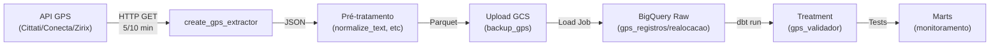
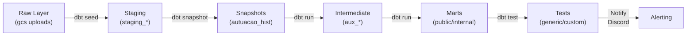

# Arquitetura da Plataforma SMTR

## Visão Geral

A plataforma de dados do SMTR (Rio de Janeiro) é um sistema integrado de captura, processamento e materialização de dados operacionais de transporte público. Utiliza **Prefect 3.4.8** para orquestração, **BigQuery** para armazenamento analítico, **dbt** para transformação, e **Redis** para coordenação em tempo real.

## Pilares Arquiteturais

### 1. Camada de Captura (Capture)

Extrai dados de fontes heterogêneas em padrão incremental:

**Fontes Integradas:**
- **GPS**: Cittati, Conecta, Zirix (registros a cada 5 min, realocações retroativas)
- **Bilhetagem JAE**: 16 pipelines especializados (transações, lançamentos, backup full)
- **Integrações Externas**: SERPRO (autuações), RioOnibus (viagens), Previnity (negativação)

**Padrão de Fluxo:**
```
Extração → Pré-tratamento → Validação → Upload GCS → BigQuery Raw
```

**Componentes Chave:**
- `create_capture_flows_default_tasks()`: orquestra fluxo padrão
- `SourceCaptureContext`: encapsula metadados de fonte
- `SourceTable`: configura origem, chaves primárias, particionamento
- Extractores especializados por tipo (API, DB, GPS)

### 2. Camada de Transformação (Treatment)

Processa dados brutos em datasets analíticos via **dbt**:

**Fluxo de Materialização:**
```
Raw (Staging) → Staging → Marts (Público) → Marts (Interno)
```

**Operações Críticas:**
- **Snapshots**: histórico de alterações (autuações, transações)
- **Testes customizados**: validação de completude, consistência, relações
- **Seletores dbt**: isolamento de domínios (bilhetagem, planejamento, trânsito)
- **Notificação de falhas**: Discord + Sentry

**Domínios de Dados:**
- **Bilhetagem**: passageiro/hora, transações, gratuidades
- **Planejamento**: GTFS, viagens planejadas, calendários
- **Trânsito**: autuações (SERPRO + CITRAN), receitas
- **Cadastro**: operadoras, linhas, garagens, consórcios
- **Infraestrutura**: custos cloud, logs BigQuery

### 3. Camada de Controle (Control)

Monitora saúde e freschness de dados:

**Processos:**
- `control__source_freshness`: valida atualizações de tabelas
- `control__set_redis_key`: sincroniza estado entre pipelines
- Redis como SSOT (Single Source of Truth) para últimos processamentos

### 4. Camada de Integração (Integration)

Orquestra fluxos de troca de dados:

**Padrão:**
- `integration__previnity_negativacao`: envia dados para plataforma de negativação
- Sincronização com sistemas externos (financeiro, negativação)

---

## Arquitetura de Componentes

```
┌─────────────────────────────────────────────────────────────┐
│                    ORCHESTRATION LAYER                       │
│                    Prefect 3.4.8 (K8s)                       │
└─────────────────────────────────────────────────────────────┘
                              │
        ┌─────────────────────┼─────────────────────┐
        │                     │                     │
        ▼                     ▼                     ▼
┌──────────────────┐  ┌──────────────────┐  ┌──────────────────┐
│  CAPTURE LAYER   │  │ TREATMENT LAYER  │  │  CONTROL LAYER   │
│                  │  │                  │  │                  │
│ • GPS (x3)       │  │ • dbt Core       │  │ • Freshness      │
│ • JAE (x16)      │  │ • Snapshots      │  │ • Redis Sync     │
│ • APIs (x4)      │  │ • Tests          │  │ • Alerting       │
│ • Backup (x13)   │  │ • Materialization│  │ • Status Board   │
└──────────────────┘  └──────────────────┘  └──────────────────┘
        │                     │                     │
        └─────────────────────┼─────────────────────┘
                              │
        ┌─────────────────────┼─────────────────────┐
        │                     │                     │
        ▼                     ▼                     ▼
┌──────────────────┐  ┌──────────────────┐  ┌──────────────────┐
│   GCS STORAGE    │  │   REDIS CACHE    │  │   BIG QUERY      │
│   (Raw Layer)    │  │  (Coordination)  │  │  (Analytical)    │
└──────────────────┘  └──────────────────┘  └──────────────────┘
```

---

## Fluxos de Dados

### Fluxo A: Captura GPS (Cittati/Conecta/Zirix)



**SLA:**
- Registros: 5 min após captura
- Realocações: 10 min após captura
- Janela de retry: 2 dias (recapture automático)

**Dependências Críticas:**
- Redis (último timestamp processado)
- GCS (backup incremental)
- BigQuery (staging + raw)

### Fluxo B: Captura Bilhetagem JAE


**Características:**
- 16 pipelines especializados (transações, lançamentos, ordem de pagamento, etc)
- Filtro incremental por data ou ID sequencial
- Paginação automática (50k-500k linhas/arquivo)
- Backup incremental + histórico (Redis)

### Fluxo C: Transformação (dbt)



**Seletores (dbt selectors):**
- `bilhetagem`: passageiro, transações, gratuidades
- `planejamento`: GTFS, viagens, calendários
- `transito`: autuações, receitas
- `cadastro`: linhas, operadoras, garagens

### Fluxo D: Backup Incremental BillingPay

```mermaid
graph LR
    A["13 DBs<br/>(JAE BillingPay)"]
    B["get_table_info<br/>(introspect)"]
    C["Classifica Filtro<br/>(datetime/integer/count)"]
    D["get_raw_backup_billingpay<br/>(incremental query)"]
    E["Pagina + Upload<br/>GCS"]
    F["set_redis_backup<br/>(SSOT)"]
    
    A -->|inspect()| B
    B -->|filter config| C
    C -->|SQL WHERE| D
    D -->|{200k-500k| E
    E -->|save_value| F
```

**Ciclo Completo (24h):**
- 00:00 → processador_transacao_db
- 01:00 → principal_db
- 01:30 → tarifa_db
- ... (13 DBs)
- 07:00 → vendas_db

---

## Mudanças Estruturais (Current State)

### Novos Pipelines de Captura GPS

Expansão para 3 operadores telemetria:

| Pipeline | Fonte | Tipo | SLA | Schedule |
|----------|-------|------|-----|----------|
| `capture__cittati_realocacao` | Cittati API | Realocação | 10 min | */10 * * * * |
| `capture__cittati_registros` | Cittati API | Registros | 5 min | * * * * * |
| `capture__conecta_realocacao` | Conecta API | Realocação | 10 min | */10 * * * * |
| `capture__conecta_registros` | Conecta API | Registros | 5 min | * * * * * |
| `capture__zirix_realocacao` | Zirix API | Realocação | 10 min | */10 * * * * |
| `capture__zirix_registros` | Zirix API | Registros | 5 min | * * * * * |

**Novo Módulo Comum:**
- `pipelines/common/capture/gps/`: extrator genérico GPS
- Constants centralizadas: endpoints, headers, intervals
- Particionamento por data (partition_date_only=True)

### Novo Pipeline de Backup BillingPay

Pipeline `capture__jae_backup_billingpay`:
- Backup incremental de **13 bancos** JAE
- Filtros inteligentes (datetime/integer/count)
- Paginação automática
- **447 linhas de constants** (excludes, filters, page_size, custom selects)
- Redis para SSOT (último valor capturado)
- Notificação Discord para tabelas grandes sem filtro

**Databases Cobertos:**
```
principal_db → Item Pedido, Pedido, Motorista, ...
tarifa_db → Matriz de Integração
transacao_db → Lote Crédito, Confirmação PMS
tracking_db → Tracking Sumarizado
ressarcimento_db → Ordem Transferência
gratuidade_db → Gratuidade, Estudante, PCD
fiscalizacao_db → Fiscalização
atm_gateway_db → Requisições
device_db → Device/Operadora
erp_integracao_db → (vazio)
financeiro_db → Conta, Movimento, Evento, Midia
midia_db → Midia, Evento, Gravação Física
processador_transacao_db → Transacao Processada
atendimento_db → (vazio)
gateway_pagamento_db → Payment Processing, CNAB
vendas_db → Venda
```

### Mudanças em Código Common

**`pipelines/common/capture/gps/`** (novo módulo):
- `constants.py`: configuração de endpoints/secrets por fonte
- `tasks.py`: `create_gps_extractor()` — extrator HTTP com params dinâmicos

**`pipelines/common/utils/fs.py`**:
- Nova função `create_partition()` — centraliza lógica de particionamento Hive
- Suporte a `partition_date_only` (data vs data+hora)

**`pipelines/common/tasks.py`**:
- Nova task `task_send_discord_message()` — wrapper para webhooks
- Integração com secret management (`WEBHOOKS_SECRET_PATH`)

---

## Padrões de Projeto

### 1. Extração Incremental

**Implementação:**
```python
# Fonte (SourceTable)
source = SourceTable(
    source_name="cittati",
    table_id="registros",
    primary_keys=["id_veiculo", "datetime_servidor"],
    first_timestamp=datetime(2025, 5, 9, ...),
)

# Contexto (SourceCaptureContext)
context = SourceCaptureContext(source, timestamp)
partition = context.get_partition()  # "data=2025-05-09/hora=14"

# Extrator personalizado
extractor = create_gps_extractor(context)
raw_data = extractor()  # partial function
```

**Vantagens:**
- Reutilização entre operadores (Cittati/Conecta/Zirix)
- Metadados centralizados
- Suporte a recaptura (últimos N dias)

### 2. Backup Incremental Parametrizado

**Tipos de Incremento:**
```python
# Datetime: filtro por coluna(s) de data
"CLIENTE_IMAGEM": ["DT_INCLUSAO", "DT_ALTERACAO"]  # OR

# Integer: filtro por ID sequencial
"MOTORISTA": ["CD_MOTORISTA"]  # BETWEEN

# Count: detecta mudanças por contagem
"pcd_mae": ["count(*)"]  # !=(last_count)

# Custom SELECT: query parametrizada
"conta": """
    select * from conta c
    left join (select id_conta, max(dt_lancamento)...)
"""
```

### 3. Pré-tratamento Unificado

**Stack de Transformações:**
```python
pipeline = [
    normalize_text(),           # strip + lower
    raise_if_column_isna(),     # validação
    strip_string_columns(),     # trim
    create_timestamp_captura(), # audit
    transform_to_nested_structure(),  # json/array
]
```

### 4. Tratamento com dbt

**Padrão Three-Layer:**
- **Staging**: limpeza, casting, deduplicação
- **Intermediate**: agregações, enriquecimento, join
- **Mart**: modelo final, SCD Type 2, histórico

**Testes Customizados:**
```sql
-- test_check_viagem_completa.sql
SELECT COUNT(*) as failures
FROM {{ ref('viagem_planejada') }}
WHERE km_observada IS NULL
```

---

## Dependências Entre Componentes

### Ordem de Execução Crítica

```
REDIS (inicializado)
    ↓
CONTROL__source_freshness (valida freshness)
    ↓
CAPTURE__gps_* (registra timestamps em Redis)
    ↓
CAPTURE__jae_* (batch jobs)
    ↓
TREATMENT__* (dbt materializações)
    ├─ wait_data_sources (espera Redis)
    ├─ run_dbt_snapshots (histórico)
    ├─ run_dbt_selectors (marts)
    └─ run_dbt_tests (validação)
    ↓
INTEGRATION__previnity (envia para negativação)
```

### Dependências de I/O

| Componente | Entrada | Saída | Storage |
|-----------|---------|-------|---------|
| Capture GPS | API HTTP | GCS + BQ Raw | GCS (hourly) |
| Capture JAE | DB SQL | GCS + BQ Raw | GCS (daily) |
| Backup JAE | DB SQL | GCS | GCS (6h/24h) |
| Treatment | BQ Raw | BQ Staging | BQ (clusters) |
| Snapshot | BQ Staging | BQ History | BQ |
| Mars | BQ Intermediate | BQ Public | BQ (partitioned) |

### Redis Keys

```
dev.capture.cittati.registros → "2025-05-09T14:35:22"
prod.capture.cittati.registros → "2025-05-09T14:35:22"

prod.backup_jae_billingpay.principal_db.PEDIDO → {
    "last_value": "2025-05-09 14:35:22"
}

prod.treatment.passageiro_hora.materialization → {
    "last_run": "2025-05-09 14:00:00"
}
```

---

## Padrões de Resiliência

### Tratamento de Falhas

**Retry Automático:**
- Capture: `max_retries=3`, backoff exponencial
- Treatment: `dbt retry` com snapshot recovery
- Notification: Discord + Sentry

**Recaptura Manual:**
```python
capture__jae_transacao(
    timestamp=None,
    recapture=True,
    recapture_days=2,  # últimas 48h
)
```

**SLA Monitorado:**
```python
control__source_freshness()  # valida atualizações
→ Alerta se > 6h sem update
```

### Idempotência

- **Keys Primárias**: deduplicação em BQ
- **Snapshots dbt**: histórico completo
- **Particionamento**: evita duplicatas entre runs

---

## Tecnologia Stack

| Layer | Tech | Version | Propósito |
|-------|------|---------|-----------|
| **Orchestration** | Prefect | 3.4.8 | Flow scheduling, state mgmt |
| **Transformation** | dbt-core | 1.x | Data modeling, testing |
| **Data Warehouse** | BigQuery | (GCP) | OLAP, partitioned datasets |
| **Storage** | GCS | (GCP) | Raw data lake, backups |
| **Cache** | Redis | 7.x | SSOT timestamps, state sync |
| **CI/CD** | GitHub Actions | (GCP) | Deploy, doc generation |
| **Secrets** | Infisical | (SaaS) | Credential management |
| **Monitoring** | Sentry | (SaaS) | Error tracking |
| **Notifications** | Discord Webhooks | (API) | Alerting |

---

## Pontos de Atenção

### 1. Particionamento GPS

- **Novo padrão**: `partition_date_only=True` (apenas data)
- **Antigo padrão**: data + hora
- **Impacto**: query performance (menos partições), storage (consolidado)
- **Migração**: recriar histórico ou aceitar gap

### 2. Backup BillingPay Scale

- **447 linhas de constants**: altamente acoplado
- **13 DBs**: janela de backup 24h
- **Risco**: mudança em schema JAE exige ajuste manual
- **Mitigação**: introspect() automático, tests

### 3. Redis SSOT

- **Crítico para**: captura incremental, deduplicação
- **Risco**: perda de dados se Redis perdido
- **Mitigação**: backup em GCS, recovery via CLI

### 4. Concorrência dbt

- **Múltiplos seletores em paralelo**: riscos de lock em BigQuery
- **Recomendação**: serializar snapshots antes de testes
- **Configuração**: `dbt_project.yml` com `models.resource_type`

---

## Próximas Iterações

### Melhorias Planejadas

1. **Abstração de Fontes**
   - Factory pattern para Extractors
   - Reduzir código duplicado nos 16 pipelines JAE

2. **Observabilidade**
   - Métricas de latência por stage
   - Lineage automático (dbt artifacts → DAG visual)

3. **Governance**
   - SLA tracking por dataset
   - Data quality frameworks (dbt + Great Expectations)

4. **Performance**
   - Compactação de partições BQ
   - Clustering em mesas grandes (transacao, midia)

---

## Referências

- **Código**: `/pipelines/` (capture, treatment, common)
- **Modelos dbt**: `/queries/models/` (por domínio)
- **Secrets**: Infisical (chaves em `{env}.{service}.{resource}`)
- **Deployments**: Prefect Cloud (work pools `smtr-pool`)